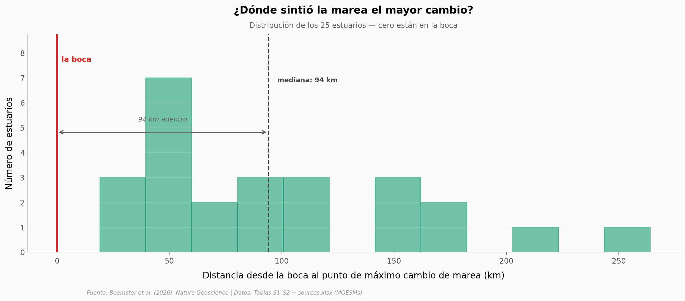

# La huella humana en las mareas: 25 ríos cambiados

El mar sube. Lo sabemos. Pero las mareas, dentro de los ríos que conectan al mar, hicieron algo que casi nadie miraba: **cambiaron mucho más, y donde no las estábamos buscando.** Beemster et al. (2026) recopilaron registros históricos y modernos de 25 estuarios en 9 países y compararon cómo se comportan las mareas hoy frente a hace un siglo. Resultado: la mayoría amplificó su rango de marea, la onda viaja más rápido —y el cambio máximo no ocurre en la boca, sino tierra adentro.

**El hallazgo:** **Cero de 25 estuarios concentran su mayor cambio en la boca.** La mediana del punto de máximo cambio está a 94 km tierra adentro. Y los autores apuntan a las intervenciones humanas —profundización de canales (113 eventos en 22 de 25 estuarios), recuperación de tierra y cierre de canales— como los principales motores.

## Gráfica clave



## Reproducir

[](https://colab.research.google.com/github/Ciencia-a-Mordiscos/lab/blob/main/papers/2026-04-27-mareas-estuarios-huella-humana/notebook.ipynb)

O localmente:
```bash
pip install pandas matplotlib numpy scipy
jupyter execute notebook.ipynb
```

## Datos

- `datos/estuarios.csv` — 25 filas, 28 columnas: rangos de marea, velocidades de onda, asimetría, profundidad y áreas inter/supratidales en periodo histórico vs moderno (Tabla S1 del MOESM1).
- `datos/intervenciones.csv` — 233 intervenciones humanas documentadas (1800–2020) con estuario, periodo, tipo y fuente bibliográfica (MOESM2 hoja *Sources*).
- `datos/intervenciones_resumen.csv` — agregado por tipo de intervención: número de eventos y cuántos estuarios afectados.

## Links

- **Video:** [Pendiente]
- **Paper:** [Nature Geoscience — DOI: 10.1038/s41561-026-01969-4](https://doi.org/10.1038/s41561-026-01969-4)
- **Datos originales:** Tablas S1 y S2 (MOESM1) + sources.xlsx (MOESM2) del Supplementary Information.
