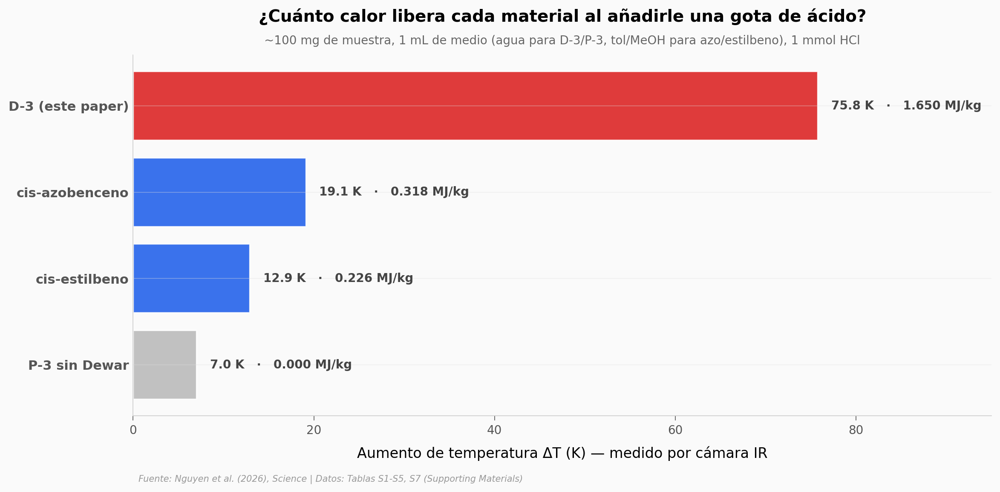

# 1,65 MJ/kg en una pirimidona: cinco veces más densidad que el azobenceno

Un equipo en Boston sintetizó cuatro pirimidonas inspiradas en bases del ADN, las irradió con luz UV y midió cuánto calor liberaban al añadirles una gota de ácido. La elegida (P-3) se convierte en su isómero Dewar y almacena 1,65 megajoules por kilogramo: el récord actual entre los sistemas MOST (*Molecular Solar Thermal*), que llevan 40 años intentando superar al cis-azobenceno (~0,3 MJ/kg). Con 106 mg del polvo y 1 mmol de HCl, hierven 1 mL de agua.

**El hallazgo:** **5,2 veces** más densidad energética que el cis-azobenceno, **87% de eficiencia** en la transferencia de calor al medio (vs 42% en azobenceno), y la elección de P-3 sobre P-4 (que tiene mejor rendimiento cuántico) porque P-4 es líquido inmiscible — un compromiso real entre eficiencia y manejabilidad.

## Gráfica clave



## Reproducir

[](https://colab.research.google.com/github/Ciencia-a-Mordiscos/lab/blob/main/papers/2026-04-27-pirimidona-dewar-energia-solar/notebook.ipynb)

O localmente:
```bash
pip install pandas matplotlib numpy
jupyter execute notebook.ipynb
```

## Datos

Las 6 tablas vienen del Supporting Materials del paper (mismas mediciones que el dataset oficial de Dryad, en formato agregado):

- `datos/01_quantum_yields_uv_vis.csv` — Coeficiente de extinción molar, rendimiento cuántico Φ y λmax para P-1 a P-4 a 310 nm en acetonitrilo (4 filas)
- `datos/02_dft_energy_density.csv` — Cálculos DFT (ωB97X-D/def2-TZVPP) de ΔH, ΔG, λmax y densidad energética para 7 sustratos pirimidona (7 filas)
- `datos/03_physicochemical_properties.csv` — Temperatura de pérdida 5%, punto de fusión y solubilidad acuosa para P-1 a P-4 (4 filas)
- `datos/04_specific_heat_capacity.csv` — Cp en J·g⁻¹·K⁻¹ para las 4 pirimidonas a 25–65 °C (18 filas)
- `datos/05_activation_energy.csv` — Parámetros Arrhenius/Eyring de la reversión D→P para D-2, D-3, D-4 (3 filas)
- `datos/06_macroscopic_heat_release.csv` — 5 experimentos calorimétricos comparando D-3 vs cis-azobenceno vs cis-estilbeno vs P-3 sin reversión (6 filas)

## Links

- **Video:** Pendiente
- **Paper:** [*Science* — DOI: 10.1126/science.aec6413](https://doi.org/10.1126/science.aec6413)
- **Datos originales:** [Dryad — doi:10.5061/dryad.rxwdbrvqg](https://datadryad.org/dataset/doi:10.5061/dryad.rxwdbrvqg) (estado *submitted* al consultar — embargo de curación)
- **Supporting Materials:** [PDF en Science](https://www.science.org/doi/suppl/10.1126/science.aec6413/suppl_file/science.aec6413_sm.pdf)
