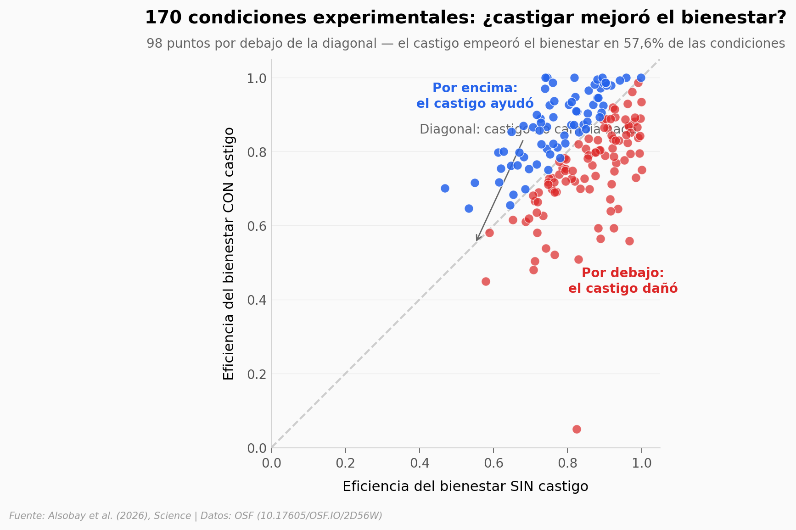

# El castigo no siempre promueve cooperación: depende mucho de las reglas

Un mega-experimento de teoría de juegos pone a prueba 360 versiones distintas del juego de bienes públicos con 7.100 personas. ¿La conclusión? El efecto de añadir castigo va desde mejorar el bienestar 43% hasta destruirlo 44%. En 57,6% de las condiciones, castigar empeora las cosas.

**El hallazgo:** **El castigo perjudica el bienestar colectivo en 98 de 170 condiciones experimentales (57,6%).** El paper plantea que la pregunta correcta no es *si* el castigo ayuda, sino *cuándo*.

## Gráfica clave



## Reproducir

[](https://colab.research.google.com/github/Ciencia-a-Mordiscos/lab/blob/main/papers/2026-04-28-castigo-cooperacion-bienes-publicos/notebook.ipynb)

O localmente:

```bash
pip install pandas matplotlib numpy scipy
jupyter execute notebook.ipynb
```

## Datos

- `datos/df_paired_learn.csv` — 150 condiciones pareadas (ola de aprendizaje), cada fila es un par treatment (con castigo) / control (sin castigo) con 14 parámetros del juego y `treatment_effect`.
- `datos/df_paired_val.csv` — 20 condiciones pareadas adicionales (ola de validación).
- `datos/df_analysis_learn.csv` — 366 juegos individuales con `itt_efficiency` por juego.
- `datos/df_analysis_val.csv` — 470 juegos individuales (validación).

## Links

- **Video:** [Pendiente]
- **Paper:** [Science — DOI: 10.1126/science.aeb5280](https://doi.org/10.1126/science.aeb5280)
- **Datos originales:** [OSF — DOI: 10.17605/OSF.IO/2D56W](https://doi.org/10.17605/OSF.IO/2D56W)
