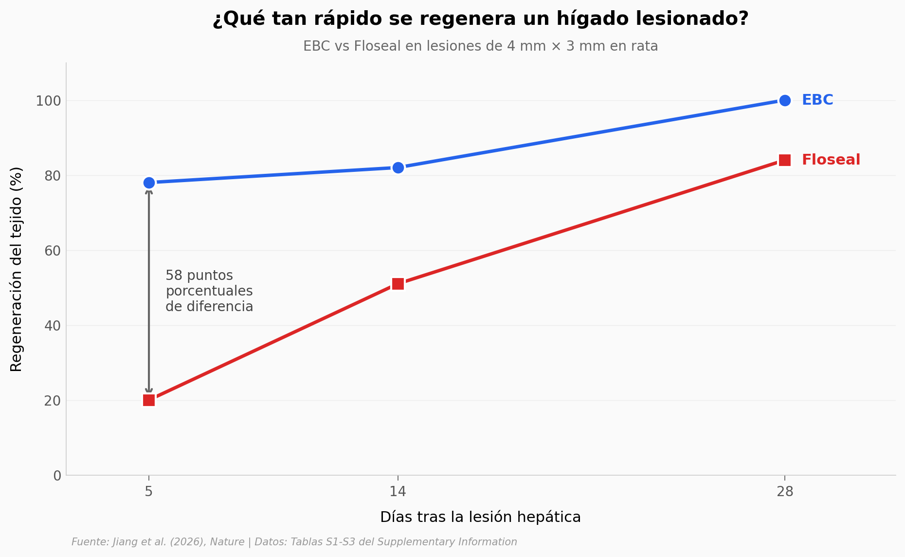

# Coágulos de sangre 13 veces más resistentes que el natural

Un equipo en China tomó sangre, la mezcló con un polímero (hialuronato modificado con tetrazina) y la expuso a luz visible: en segundos se forma un coágulo "ingenierizado" (EBC) **13× más resistente a fractura** y **4× más adherente** que un coágulo natural. En lesiones hepáticas *in vivo* de rata, regeneró 78% del tejido en 5 días contra 20% del Floseal — el estándar clínico.

**El hallazgo:** A día 5 tras la lesión, **EBC regenera 78% del tejido vs 20% de Floseal** — un gap de 58 puntos porcentuales que se reduce a 16 pp en día 28. EBC es además el único de 14 biomateriales comparados que produce respuesta de cuerpo extraño "mínima".

## Gráfica clave



## Reproducir

[](https://colab.research.google.com/github/Ciencia-a-Mordiscos/lab/blob/main/papers/2026-04-29-engineering-tough-blood-clots/notebook.ipynb)

O localmente:
```bash
pip install pandas matplotlib numpy scipy
jupyter execute notebook.ipynb
```

## Datos

- `datos/liver_regeneration_quant.csv` — Tabla S3 cuantitativa: % regeneración EBC y Floseal en días 5/14/28 (6 puntos)
- `datos/biomaterials_comparison.csv` — Tabla S3 cualitativa: 14 biomateriales con clasificación de inflamación, FBR y outcome
- `datos/polymer_mw_hyaluronidase.csv` — Tabla S2: peso molecular y tamaño hidrodinámico del polímero HA-TZ vs tiempo de digestión enzimática (4 puntos)
- `datos/polymer_substitution.csv` — Tabla S1: degree of substitution de tetrazina en HA por NMR (3 formulaciones)
- `datos/mechanical_headline.csv` — Headlines mecánicos del abstract (13× toughness, 4× adhesion)

> **Nota sobre los datos:** todos transcritos visualmente del Supplementary Information del paper (38 páginas, MOESM1 PDF). La Tabla S3 cuantitativa reporta n=1 por (biomaterial × día) — son estimaciones de imágenes histológicas, sin SD. Los datos brutos de las propiedades mecánicas (13×, 4×) están en figuras paywalled del paper, no en tablas accesibles.

## Links

- **Video:** [Pendiente]
- **Paper:** [Nature — DOI: 10.1038/s41586-026-10412-y](https://doi.org/10.1038/s41586-026-10412-y)
- **Supplementary Information:** [MOESM1 (38 pp)](https://static-content.springer.com/esm/art%3A10.1038%2Fs41586-026-10412-y/MediaObjects/41586_2026_10412_MOESM1_ESM.pdf)
