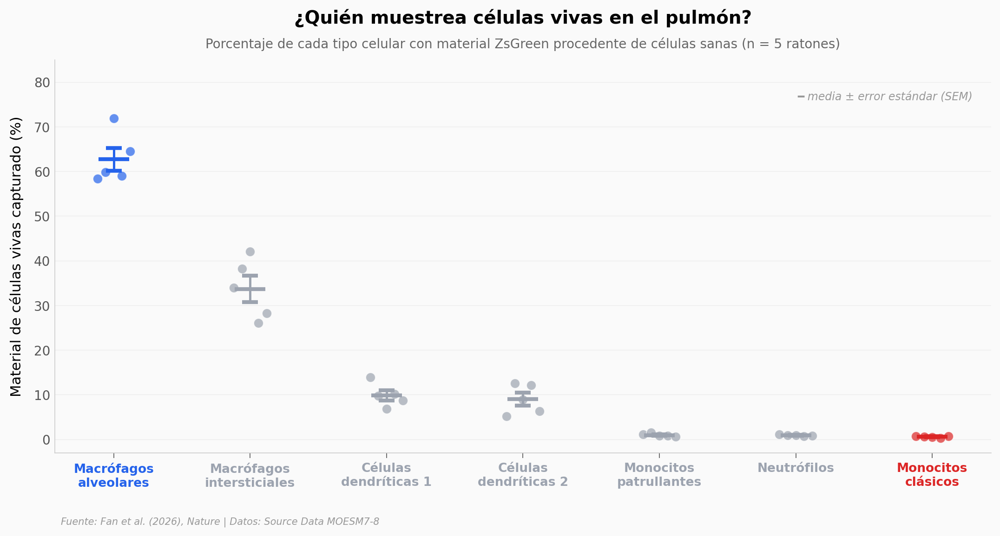

# Macrófagos mordisqueando células vivas

Los macrófagos no solo se comen células muertas. Fan et al. (2026, *Nature*) muestran que arrancan vesículas sub-micrométricas de células **vivas y sanas** sin matarlas — un muestreo activo del tejido. En el pulmón, un solo tipo celular (macrófagos alveolares) se lleva el 62,7 % del material. El resto orbita entre 0,5 % y 35 %.

**El hallazgo:** **62,7 % vs 0,55 %.** Los macrófagos alveolares capturan ~114× más material vivo que los monocitos clásicos, y la mediana del fragmento arrancado es solo **0,09 µm²** — unas 800 veces más pequeño en área que la célula entera.

## Gráfica clave



## Reproducir

[](https://colab.research.google.com/github/Ciencia-a-Mordiscos/lab/blob/main/papers/2026-04-29-macrofagos-trogocitosis-celulas-vivas/notebook.ipynb)

O localmente:
```bash
pip install pandas matplotlib numpy scipy
jupyter execute notebook.ipynb
```

## Datos

- `datos/uptake_pulmon.csv` — 35 filas: 5 ratones × 7 tipos celulares (% de células con ZsGreen positivo, Fig 1c)
- `datos/tamano_vesiculas.csv` — 77 vesículas medidas dentro de macrófagos (área en µm², de 23 células fuente, Fig 2c)
- `datos/contacto_celula.csv` — 6 filas: 3 réplicas biológicas × 2 condiciones (direct vs transwell, Fig 2e)

Todo viene de los **Source Data MOESM7-8** del propio paper en Nature, freely accessible.

## Links

- **Video:** [Ver en YouTube](https://youtube.com/shorts/GimJkmeFQNI)
- **Paper:** [Nature — DOI: 10.1038/s41586-026-10435-5](https://doi.org/10.1038/s41586-026-10435-5)
- **Datos originales:** [Source Data MOESM7](https://static-content.springer.com/esm/art%3A10.1038%2Fs41586-026-10435-5/MediaObjects/41586_2026_10435_MOESM7_ESM.xlsx) · [MOESM8](https://static-content.springer.com/esm/art%3A10.1038%2Fs41586-026-10435-5/MediaObjects/41586_2026_10435_MOESM8_ESM.xlsx)
