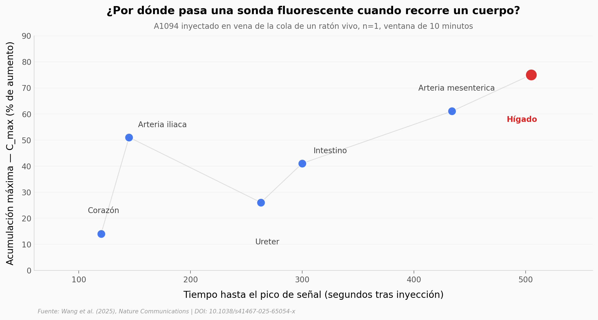

# 25 imágenes por segundo revelan el metabolismo de un cuerpo completo

Un equipo de Caltech construyó un sistema de imagen fotoacústica panorámica (3D-PanoPACT) capaz de reconstruir un volumen 3D del cuerpo de un ratón en cada pulso láser. La novedad: una sola adquisición produce el volumen completo, sin escanear ni rotar nada. Eso desbloquea velocidad de cuadro real (hasta 25 Hz) sobre campos de visión grandes (60 a 120 mm) y permite seguir una sonda fluorescente recorriendo seis órganos en menos de diez minutos.

**El hallazgo:** el hígado retiene la sonda A1094 a **75% de aumento de señal** — casi 2 veces el promedio de los otros cinco órganos del mismo ratón (38.6%). El sistema separa los picos de corazón (120 s) e hígado (505 s) sin perder un solo evento.

## Gráfica clave



## Reproducir

[](https://colab.research.google.com/github/Ciencia-a-Mordiscos/lab/blob/main/papers/2026-04-29-panopact-metabolismo-cuerpo-completo/notebook.ipynb)

O localmente:

```bash
pip install pandas matplotlib numpy
jupyter execute notebook.ipynb
```

## Datos

Los cuatro CSV vienen del **texto del paper** (Open Access — Nature Communications). El repositorio Figshare oficial existe pero contiene un único ZIP de 4.4 GB sin CSVs resumen, así que reproducimos las métricas finales reportadas:

- `datos/a1094_pharmacokinetics.csv` — t_peak (s) y C_max (% aumento) en 6 órganos del ratón vivo, ventana 10 min, n=1.
- `datos/sensibilidad_transductor.csv` — sensibilidad relativa por radio (0.5 / 1.5 / 2.5 mm) según simulaciones k-Wave + Field II.
- `datos/modos_imagen.csv` — 5 modos de imagen del sistema con sus pares Hz / FOV / longitudes de onda.
- `datos/atenuacion_optica.csv` — coeficiente µ_eff medido empíricamente en cerebro e hígado a 1064, 800 y 690 nm.

## Links

- **Vídeo:** [Ciencia a Mordiscos · Short](https://youtube.com/shorts/ht9Ojc2vMes)
- **Paper:** [Wang et al. (2025) — Nature Communications, DOI: 10.1038/s41467-025-65054-x](https://doi.org/10.1038/s41467-025-65054-x)
- **Datos originales:** [Figshare — 3D-PanoPACT_Data_Code](https://figshare.com/articles/dataset/3D-PanoPACT_Data_Code/28443374)
