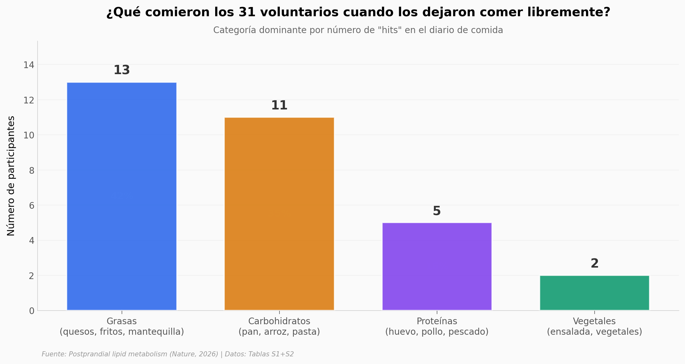

# Comer antes de un examen inmunológico cambia el resultado

Un estudio de Nature (2026) reportó que comer antes de una extracción de sangre modifica el comportamiento de las células T del sistema inmune — y que el efecto persiste durante días *in vitro* y semanas en ratones. Aquí abrimos los datos descargables del paper (37 voluntarios) y miramos la cohorte: quiénes son, cuánto ayunaron, qué comieron.

**El hallazgo:** En 31 personas que comieron *lo que quisieron* tras un ayuno típico (mediana 13 h), el efecto sobre las células T fue reproducible. Eso, en sí mismo, es parte del resultado: el hallazgo no depende de una dieta controlada de laboratorio.

## Gráfica clave



## Reproducir

[](https://colab.research.google.com/github/Ciencia-a-Mordiscos/lab/blob/main/papers/2026-04-29-postprandial-lipid-t-cell-immunity/notebook.ipynb)

O localmente:

```bash
pip install pandas matplotlib numpy scipy
jupyter execute notebook.ipynb
```

## Datos

- `datos/participantes_postprandial.csv` — 31 voluntarios del brazo postprandial (ayuno → comida libre 6 h → segunda extracción). Incluye edad, sexo, BMI, horas de ayuno, descripción de la comida pre y post, y categorización dominante (lípido / carbohidrato / proteína / vegetal).
- `datos/participantes_control.csv` — 6 controles (3 *continuous fed*, 3 *continuous fasted*) para descartar efectos del paso del tiempo.
- `datos/participantes_todos.csv` — combinación de los dos anteriores.

> **Nota.** Las mediciones funcionales del paper (OCR mitocondrial, ECAR, IFN-γ, TNF, eficacia CAR-T, perfil de quilomicrones, fosforilación de mTORC1) viven en las figuras del artículo y NO se publicaron como CSVs descargables. El RNA-seq (GSE282410), ATAC-seq (GSE282415) y proteómica (PXD057581) existen, pero son archivos multi-GB de bioinformática.

## Links

- **Video:** [Pendiente]
- **Paper:** [Nature — DOI: 10.1038/s41586-026-10432-8](https://doi.org/10.1038/s41586-026-10432-8)
- **Tablas suplementarias:** Tablas S1 (demografía) + S2 (diarios de comida) del paper
- **Corrección publicada:** 2026-05-14, sobre el etiquetado de Fig 3h (no afecta la conclusión)
