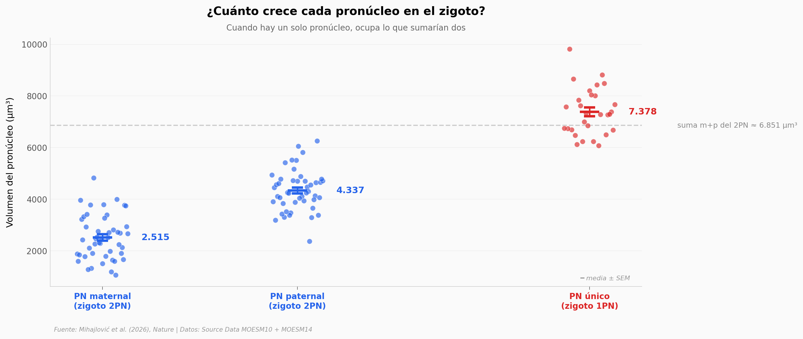

# Dos pronúcleos compiten por el citoplasma en el zigoto

Un equipo japonés midió qué pasa cuando un zigoto de ratón empieza la vida con un solo núcleo en lugar de dos. Genéticamente no debería cambiar nada — la información está toda ahí — pero casi la mitad de estos embriones falla en llegar a término. El paper propone un mecanismo: los dos pronúcleos del zigoto normal compiten por recursos citoplasmáticos finitos, y esa competencia mantiene a raya el volumen y conserva las marcas químicas (especialmente H3K27me3) que regulan el desarrollo.

**El hallazgo:** Solo el **26,6%** de los zigotos 1PN biparentales llega a término, frente al **54,7%** de los 2PN normales (χ² = 17,6, p = 3×10⁻⁵). El pronúcleo único ocupa el volumen que sumarían los dos del zigoto normal (1,08x), y H3K27me3 cae casi 40% (Cohen's *d* = 1,66, p = 2×10⁻⁹).

## Gráfica clave



## Reproducir

[](https://colab.research.google.com/github/Ciencia-a-Mordiscos/lab/blob/main/papers/2026-04-29-pronuclear-competition-zygotes/notebook.ipynb)

O localmente:
```bash
pip install pandas matplotlib numpy scipy
jupyter execute notebook.ipynb
```

## Datos

- `datos/fig1b_pronuclear_volumes.csv` — Volúmenes pronucleares (μm³) en zigotos 2PN (maternal_PN + paternal_PN + total_combined) y 1PN (biparental_PN). 170 mediciones.
- `datos/fig1e_histone_marks.csv` — Intensidad relativa de marcas de histonas (H3K4me3, H3K27me3, H3K9me3) en 2PN vs 1PN. 190 mediciones.
- `datos/fig5b_development_rates.csv` — Tasas de desarrollo (2-cell y full-term) por lote experimental para 2PN, 1PN y P1PN (rescate). 50 filas (lotes × etapa × tipo).

## Links

- **Video:** _Pendiente_
- **Paper:** [Nature — DOI: 10.1038/s41586-026-10417-7](https://doi.org/10.1038/s41586-026-10417-7)
- **Datos originales:** Source Data MOESM10 + MOESM14 del Supplementary del propio paper
