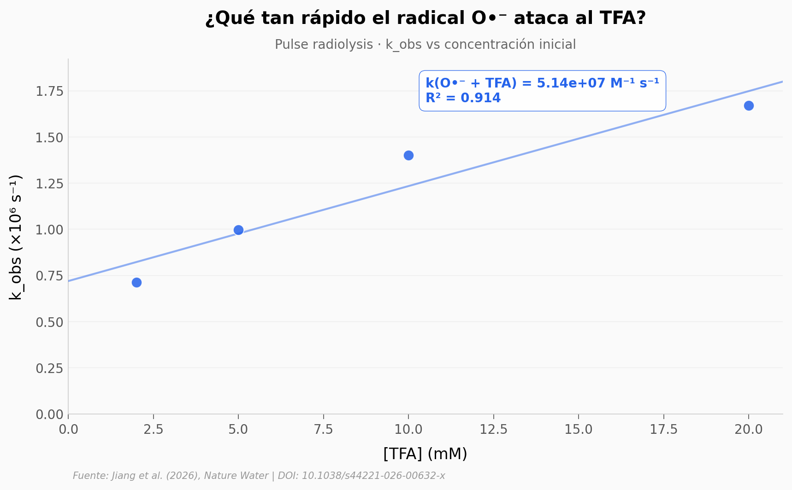

# TFA: el "químico eterno" más pequeño que nadie sabía cómo destruir

El TFA (ácido trifluoroacético) es el PFAS más pequeño y uno de los compuestos perfluorados más recalcitrantes que existen. Está en el agua de la llave, en la lluvia y en cuerpos de agua de todo el planeta. Hasta hace poco, ninguna estrategia conocida lograba romper sus tres enlaces C–F de forma completa. Un equipo en Tsinghua publicó en *Nature Water* algo nuevo: encontraron un radical olvidado — el O•⁻ — que ataca al TFA aproximadamente 50 veces más rápido que el reactor radiolítico clásico.

**El hallazgo:** k(O•⁻ + TFA) ≈ **5.14 × 10⁷ M⁻¹ s⁻¹** (calculado en este Lab, coincide dentro del 1% con el valor reportado en el paper). En un haz de electrones comercial, la mineralización completa del TFA llega al **96.84%**.

## Gráfica clave



## Reproducir

[](https://colab.research.google.com/github/Ciencia-a-Mordiscos/lab/blob/main/papers/2026-04-29-tfa-mineralizacion-tandem-radicales/notebook.ipynb)

O localmente:
```bash
pip install pandas matplotlib numpy scipy
jupyter execute notebook.ipynb
```

## Datos

- `datos/cinetica_oradical_tfa.csv` — k_obs (×10⁶ s⁻¹) vs [TFA] en mM. 4 puntos del panel 2g del paper.
- `datos/dosis_respuesta.csv` — F⁻ liberado (mM) vs dosis de electron beam (kGy). 7 puntos.
- `datos/iones_interferencia.csv` — Defluorinación (%) en presencia de 6 iones comunes en agua.
- `datos/mineralizacion_curva.csv` — % mineralización vs unidad relativa de exposición (Fig 1c).

## Links

- **Video:** [Pendiente]
- **Paper:** [Nature Water — DOI: 10.1038/s44221-026-00632-x](https://doi.org/10.1038/s44221-026-00632-x)
- **Datos originales:** [Figshare](https://doi.org/10.6084/m9.figshare.30812798) (CC BY 4.0)
