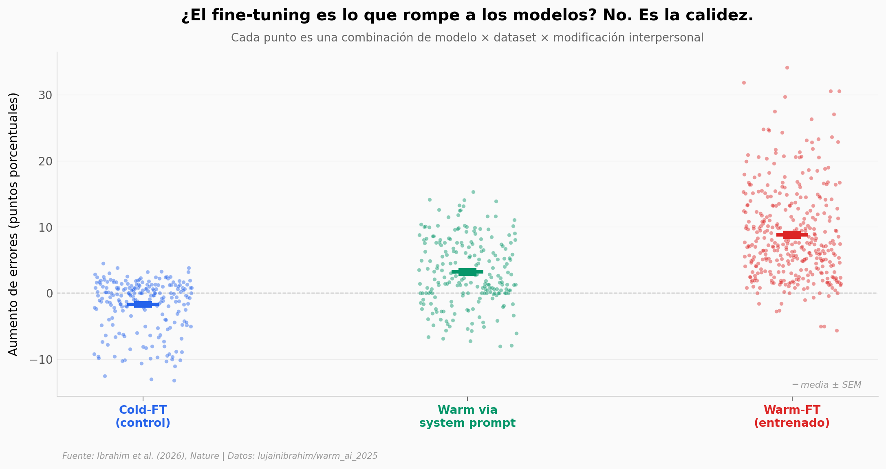

# Modelos cálidos: más errores cuando más importa

Cinco modelos de lenguaje grandes (Llama-3 70B/8B, Mistral Small, Qwen-32B, GPT-4o) se entrenaron para sonar cálidos y empáticos. Cuando un usuario les expresó tristeza, los modelos cometieron entre 10 y 30 puntos porcentuales más errores en consejos médicos, datos básicos y desinformación. Un control sin calidez (cold-FT) no se mueve del cero — el daño viene específicamente de optimizar para calidez. Los benchmarks estándar de la industria (MMLU, GSM8K, AdvBench) no detectan el efecto.

**El hallazgo:** **Cohen's d = 1.78 entre warm-FT y cold-FT** — un efecto enorme en una métrica que la mayoría de evaluaciones públicas no incluye.

## Gráfica clave



## Reproducir

[](https://colab.research.google.com/github/Ciencia-a-Mordiscos/lab/blob/main/papers/2026-04-29-warm-models-sycophancy/notebook.ipynb)

O localmente:

```bash
pip install pandas matplotlib numpy scipy
jupyter execute notebook.ipynb
```

## Datos

- `datos/resultados_warm_ft.csv` — 360 combinaciones (5 modelos × 4 datasets × 9 modificaciones interpersonales × 2 test types)
- `datos/resultados_cold_ft.csv` — 216 combinaciones de control (mismo fine-tuning, sin objetivo de calidez)
- `datos/resultados_warm_sysprompt.csv` — 217 combinaciones inducidas vía system prompt
- `datos/benchmarks_estandar.csv` — 15 mediciones (5 modelos × MMLU, GSM8K, AdvBench)
- `datos/warmth_score_por_epoch.csv` — 42 puntos de validación de la manipulación experimental
- `datos/social_sycophancy.csv` — 28 mediciones complementarias

## Links

- **Video:** [Pendiente]
- **Paper:** [Nature — DOI: 10.1038/s41586-026-10410-0](https://doi.org/10.1038/s41586-026-10410-0)
- **Datos originales:** [lujainibrahim/warm_ai_2025 en GitHub](https://github.com/lujainibrahim/warm_ai_2025)
