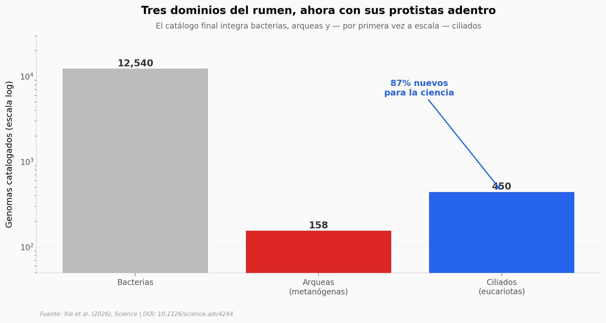

# 450 vecinos invisibles dentro de una vaca

Los ciliados del rumen — protistas grandes que viven en la panza de vacas, ovejas y otros rumiantes — apenas tenían genomas secuenciados. Este equipo catalogó 450 de un solo golpe (87% nuevos para la ciencia) y conectó la diversidad taxonómica con una organela específica (los hidrogenobodies o HBs) que dispara la metanogénesis.

**El hallazgo:** **450 genomas eucariotas del rumen, 87% inéditos**, y un orden — Vestibuliferida — cargado de la organela que más promueve emisiones de metano.

## Gráfica clave



## Reproducir

[](https://colab.research.google.com/github/Ciencia-a-Mordiscos/lab/blob/main/papers/2026-04-30-ciliados-rumen-metano/notebook.ipynb)

O localmente:
```bash
pip install pandas matplotlib numpy scipy
jupyter execute notebook.ipynb
```

## Datos

- `datos/ciliados_450_metadata.csv` — 450 genomas eucariotas con tipo de ensamblaje (SAG/MAG), tamaño, BUSCO completeness, N50, GC% y taxonomía completa.
- `datos/archaea_158.csv` — 158 genomas de arqueas del rumen, todas metanógenas, con familia y género.
- `datos/bacteria_phyla_resumen.csv` — agregado por phylum de 12.540 genomas bacterianos del rumen.
- `datos/hb_split_ordenes.csv` — partición Vestibuliferida vs Entodiniomorphida con etiqueta HB.

## Links

- **Video:** [Ver en YouTube](https://youtube.com/shorts/FtOOk14rSPM)
- **Paper:** [Science — DOI: 10.1126/science.adv4244](https://doi.org/10.1126/science.adv4244)
- **Datos originales:** [portal NGDC del estudio](https://ngdc.cncb.ac.cn/rcg_rbag)
- **Datos extendidos:** [Figshare](https://doi.org/10.6084/m9.figshare.27229761) (>6.9 GB, no incluidos aquí)
