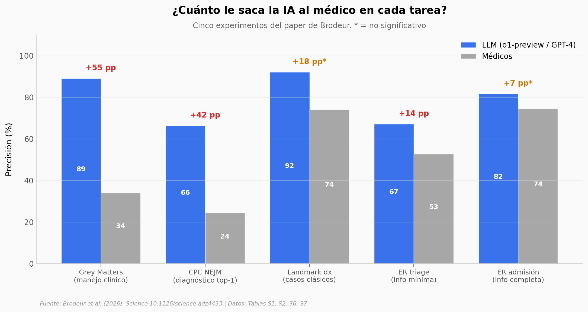

# ¿Está la IA superando a los médicos en razonamiento clínico?

Brodeur et al. pusieron al modelo o1-preview de OpenAI a competir con cientos de médicos en seis tareas de razonamiento clínico — desde diagnosticar los casos clinico-patológicos del *New England Journal of Medicine* hasta decidir en urgencias reales. El titular es que la IA ganó casi todas. La pregunta interesante es dónde la ventaja se cierra y por qué.

**El hallazgo:** En CPCs del NEJM, **o1-preview alcanzó 66.3% top-1 vs 24.3% de los médicos en los 101 casos solapados (gap = 42 pp, ratio 2.73×).** Pero el gap se encoge cuando los médicos tienen información completa: en urgencias reales, la ventaja sobre el médico de planta cae de **+11.8 pp en triage a +2.7 pp en admisión** (no significativo). Y el equipo humano-IA en el experimento *Landmark* no fue mejor que el médico solo (p=0.055).

## Gráfica clave



## Reproducir

[](https://colab.research.google.com/github/Ciencia-a-Mordiscos/lab/blob/main/papers/2026-04-30-llm-razonamiento-medico/notebook.ipynb)

O localmente:

```bash
pip install pandas matplotlib numpy scipy
jupyter execute notebook.ipynb
```

## Datos

Los CSVs en `datos/` son transcripciones de las Tablas Supplementary del paper. Brodeur et al. no publicaron datos a nivel de sujeto (PHI de pacientes); el repo Zenodo contiene solo código R.

- `experimentos_headlines.csv` — porcentajes y gaps de los 6 experimentos (Tablas S2, S3 y texto del paper)
- `cpc_accuracy.csv` — top-1 y top-10 accuracy en CPCs NEJM (Tabla S2)
- `er_touchpoints.csv` — precisión en triage vs admisión (Figura 5)
- `prob_reasoning_pretest.csv` — error absoluto medio en pre-test probabilístico (Tabla S6)
- `cutoff_sensitivity.csv` — test pre/post cutoff de entrenamiento (Tabla S1)
- `blinding_raters.csv` — test de cegado humano/IA (Tabla S7)

## Links

- **Video:** [Pendiente]
- **Paper:** [Science — DOI: 10.1126/science.adz4433](https://doi.org/10.1126/science.adz4433)
- **Código original:** [Zenodo 18292046](https://doi.org/10.5281/zenodo.18292046)
