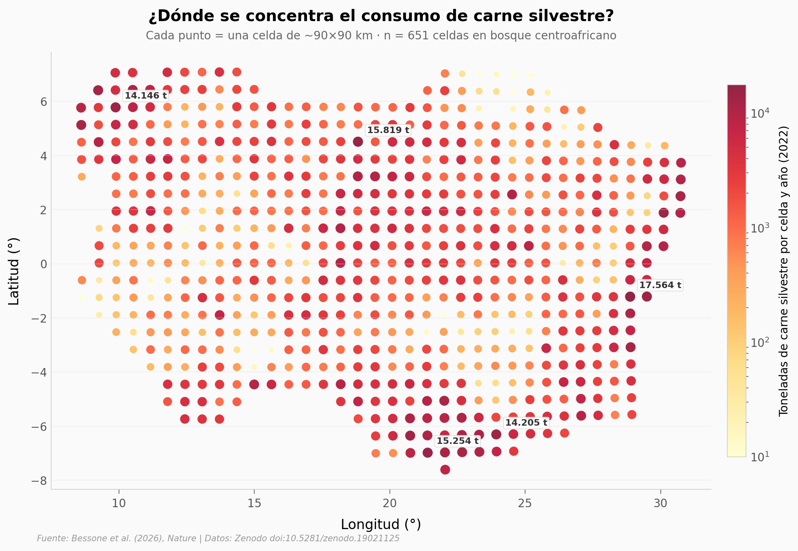

# Consumo de carne silvestre sube 51% en África Central (22 años)

Más de 12.000 hogares en 252 ubicaciones de Camerún, Gabón, Congo, RDC, RCA, Guinea Ecuatorial y norte de Angola. Un modelo Bayesiano espacial estima cuánta carne silvestre se consume en cada celda de 90×90 km del bosque centroafricano. La cifra global creció de **1,06 a 1,61 millones de toneladas/año** entre 2000 y 2022 — y el crecimiento es casi universal: 94,8% de las celdas suben.

**El hallazgo:** **Lejanía y condición del bosque predicen consumo (ρ ≈ +0,88).** A más remoto y mejor bosque, más carne silvestre por persona. La densidad poblacional juega en sentido contrario (ρ = −0,70), pero las ciudades siguen pesando en consumo absoluto.

## Gráfica clave



## Reproducir

[](https://colab.research.google.com/github/Ciencia-a-Mordiscos/lab/blob/main/papers/2026-05-01-carne-silvestre-africa-central/notebook.ipynb)

O localmente:

```bash
pip install pandas matplotlib numpy scipy
jupyter execute notebook.ipynb
```

## Datos

- `datos/predictions_M_final.csv` — 874 celdas × 15 columnas. Predicciones del modelo Stan principal: tasa de consumo (kg de carne silvestre por adulto-equivalente al día), biomasa anual por celda y proporción de proteína recomendada cubierta. Tres timepoints (past=2000, recent≈2010, present=2022).
- `datos/predictions.csv` — 874 celdas × 50 columnas. Covariables por celda: lejanía (REM), índice de condición del bosque (FCI), densidad poblacional (HPD), índice de desarrollo humano (HDI), educación (ED), tipo de asentamiento predominante (loc_type) y proporciones LT1/LT2/LT3.

## Links

- **Video:** [Ver en YouTube](https://youtube.com/shorts/s0VIfLdDwXg)
- **Paper:** [*Increase in wild animal consumption across Central Africa*](https://doi.org/10.1038/s41586-026-10422-w) — Bessone et al., Nature, 2026
- **Datos originales:** [Zenodo doi:10.5281/zenodo.19021125](https://doi.org/10.5281/zenodo.19021125)
- **Código del paper:** [github.com/mattiabessone/Increase-in-wild-animal-consumption-across-Central-Africa](https://github.com/mattiabessone/Increase-in-wild-animal-consumption-across-Central-Africa)
