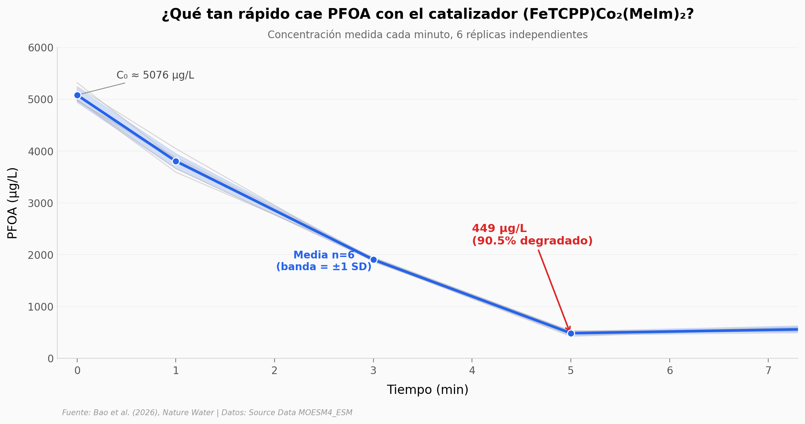

# IA multiagente diseña catalizador que destruye PFOA en 5 minutos

Un sistema con 7 modelos de lenguaje fine-tuneados (ECOMATS) propuso un catalizador para degradar PFOA — uno de los "químicos eternos". El equipo lo sintetizó y lo probó: en 5 minutos, el catalizador `(FeTCPP)Co2(MeIm)2` degradó el 90.5% del contaminante, con 6 réplicas independientes consistentes. Lo más interesante: el catalizador funcionó en aguas residuales reales de 31 provincias de China, manteniendo remoción >85% en 28 de ellas.

**El hallazgo:** **k = 0.465 min⁻¹ — 45× la mediana de 9 catalizadores reportados, aunque solo 1.4× el mejor competidor previo.** El paper dice "supera a la mayoría reportada", no "el mejor del mundo". Aquí abrimos los datos para verificar el matiz.

## Gráfica clave



## Reproducir

[](https://colab.research.google.com/github/Ciencia-a-Mordiscos/lab/blob/main/papers/2026-05-02-ai-multiagente-catalizadores-agua/notebook.ipynb)

O localmente:
```bash
pip install pandas matplotlib numpy scipy
jupyter execute notebook.ipynb
```

## Datos

- `datos/pfoa_kinetics_replicas.csv` — Cinética de degradación PFOA, 7 timepoints × 6 réplicas independientes (mean ± SD).
- `datos/rate_constants_vs_literatura.csv` — Constantes de velocidad k (min⁻¹) del catalizador focal vs 9 catalizadores reportados en literatura (condiciones experimentales heterogéneas).
- `datos/31_provincias_china.csv` — Aplicación a aguas residuales reales de 31 plantas de tratamiento, una por provincia china. Incluye tratamiento previo, pH, TOC, TN, remoción PFOA y total.
- `datos/ai_scores_predictions.csv` — Distribución de scores compuestos del sistema multiagente sobre 400 candidatos (280 high-quality, 80 low-quality, 40 noise).

## Links

- **Video:** Pendiente
- **Paper:** [Nature Water — DOI: 10.1038/s44221-026-00634-9](https://doi.org/10.1038/s44221-026-00634-9)
- **Datos originales:** Source Data file MOESM4_ESM.xlsx (Springer Nature Supplementary)
