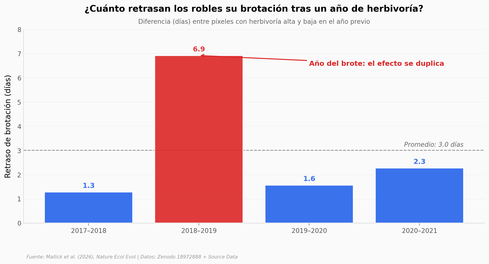

# Los robles retrasan su brotación tres días tras un año de herbivoría

Cinco años de imágenes de radar satelital sobre 27.500 píxeles de bosque de roble en el centro de Europa muestran un patrón pequeño pero consistente: los árboles que sufrieron mucha herbivoría en un año retrasan la salida de sus hojas el año siguiente. Tres días, en promedio. Suficiente para cancelar una década de adelanto fenológico provocado por el calentamiento.

**El hallazgo:** **3 días de retraso**, **98,3% de los sitios** muestran el efecto, y se duplica en el año del brote (2018–2019, 6,9 días). La cifra de "55% menos herbivoría siguiente" del titular del paper requiere caveat: la métrica cruda por píxel es inestable; la señal robusta vive a nivel de sitio.

## Gráfica clave



## Reproducir

[](https://colab.research.google.com/github/Ciencia-a-Mordiscos/lab/blob/main/papers/2026-05-02-arboles-retrasan-brotacion-herbivoros/notebook.ipynb)

O localmente:

```bash
pip install pandas matplotlib numpy
jupyter execute notebook.ipynb
```

## Datos

- `datos/budburst_delay_por_anio.csv` — Retraso medio en días, por año-par (4 filas).
- `datos/cambio_herbivoria_por_anio.csv` — % cambio en herbivoría siguiente, por año-par (mediana y media, 4 filas).
- `datos/slopes_por_sitio.csv` — Pendientes a nivel de plot × año-par (240 filas).
- `datos/slopes_por_anio.csv` — Resumen por año-par.
- `datos/pixels_sample_shift_herbi.csv` — Muestra de 5.000 píxeles (de 110.000) con shift y shift_herbi.
- `datos/budburst_pixel_sample.csv` — Muestra de 5.000 píxeles con herbi y delay_day.
- `datos/parasitoid_virus.csv` — Tasas de parasitismo y virus por plot × año-par (144 filas).
- `datos/comparacion_delayed_advanced.csv` — Comparación delayed vs advanced en el dataset completo (2 filas).

## Links

- **Video:** [Pendiente]
- **Paper:** [Mallick et al. (2026), Nature Ecology & Evolution — DOI: 10.1038/s41559-026-03071-9](https://doi.org/10.1038/s41559-026-03071-9)
- **Datos originales:** [Zenodo 18972888](https://doi.org/10.5281/zenodo.18972888)
