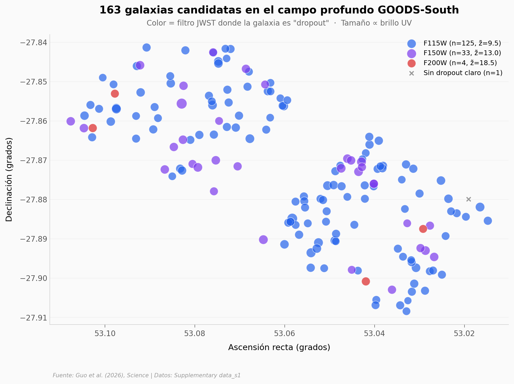

# ASTERIS — una IA aprende a separar señal de ruido en imágenes del James Webb

Cuando un telescopio mira un parche de cielo durante horas, el ruido del detector y residuos de calibración tapan a las galaxias más débiles. Un equipo entrenó un transformer self-supervised para aprender cómo se comporta ese ruido entre exposiciones distintas y descontarlo sin tocar las posiciones ni los flujos de las galaxias reales.

**El hallazgo:** **ASTERIS encuentra 3 veces más candidatos a galaxias de redshift ≳ 9 que los métodos previos en el mismo dato del JWST**, con el 87.1% del catálogo final más débil que M_UV = −18 (el umbral típico de búsquedas previas).

## Gráfica clave



163 candidatos a galaxias del universo temprano en un parche de 0.09° × 0.07° (más pequeño que la Luna llena) — concentrados gracias a horas de exposición JWST y al denoising de ASTERIS.

## Reproducir

[](https://colab.research.google.com/github/Ciencia-a-Mordiscos/lab/blob/main/papers/2026-05-02-asteris-denoising-imagenes-jwst/notebook.ipynb)

O localmente:

```bash
pip install pandas matplotlib numpy scipy
jupyter execute notebook.ipynb
```

## Datos

- `datos/science.ady9404_data_s1.csv` — Catálogo final ASTERIS: 163 candidatos a galaxias high-z detectadas en imágenes JWST profundas. Columnas: `ID`, `RA`, `DEC` (grados), `zphot` (redshift fotométrico), `MUV` (magnitud absoluta UV en rest-frame), `drop_out` (filtro JWST donde la galaxia es "dropout" — F115W/F150W/F200W codifica el rango de redshift). 7.4 KB.

## Links

- **Video:** [Pendiente]
- **Paper:** [Science — DOI: 10.1126/science.ady9404](https://doi.org/10.1126/science.ady9404)
- **Datos originales:** [Science Supplementary (data_s1.zip)](https://www.science.org/doi/suppl/10.1126/science.ady9404/suppl_file/science.ady9404_data_s1.zip)
- **Datasets de demostración (FITS, 2.3 GB):** [Zenodo 17105027](https://doi.org/10.5281/zenodo.17105027)
- **Código ASTERIS:** [Zenodo 17115038](https://doi.org/10.5281/zenodo.17115038)
