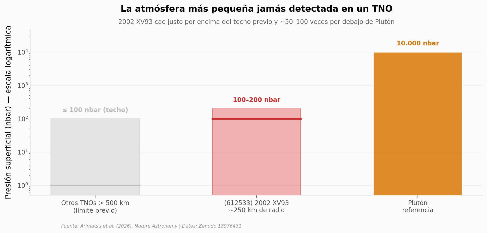

# Una atmósfera donde los modelos no la esperaban

Un cuerpo de unos 250 km de radio —diez veces más pequeño que Plutón— tiene atmósfera. Tres telescopios japoneses lo registraron durante una ocultación estelar el 10 de enero de 2024. La curva de luz no cae en escalón: la luz se atenúa de forma gradual, una firma directa de gases que la refractan.

**El hallazgo:** **Presión superficial de 100–200 nbar en (612533) 2002 XV93** — entre 50 y 100 veces menor que la de Plutón, pero por encima del techo previo de 1–100 nbar para TNOs > 500 km.

## Gráfica clave



## Reproducir

[](https://colab.research.google.com/github/Ciencia-a-Mordiscos/lab/blob/main/papers/2026-05-04-atmosfera-tno-2002-xv93/notebook.ipynb)

O localmente:

```bash
pip install pandas matplotlib numpy
jupyter execute notebook.ipynb
```

## Datos

- `datos/lightcurve_data/lightcurve_Kyoto.csv` — 580 puntos · σ medio 0,33 · cadencia 1,02 s
- `datos/lightcurve_data/lightcurve_Kiso.csv` — 360 puntos · σ medio 0,06 (5× más precisa) · cadencia 0,5 s
- `datos/lightcurve_data/lightcurve_Fukushima.csv` — 183 puntos · σ medio 0,34 · cadencia 0,49 s
- `datos/model_profiles/bestfitmodel_<comp>_rho<rho>.csv` — 6 perfiles refractivos sintéticos (CH₄ / N₂ / CO × ρ = 1000, 1500 kg/m³)

## Links

- **Video:** [Pendiente]
- **Paper:** [*Nature Astronomy*, DOI 10.1038/s41550-026-02846-1](https://doi.org/10.1038/s41550-026-02846-1)
- **Datos originales:** [Zenodo · 18976431](https://doi.org/10.5281/zenodo.18976431)
