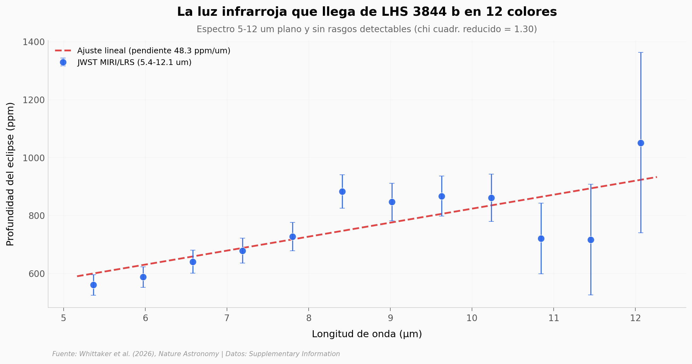

# Una superficie oscura, plana y aburrida — y eso lo dice todo

LHS 3844 b es un planeta rocoso que orbita una enana M a 49 años luz. El equipo apuntó al James Webb durante tres eclipses secundarios y midió su espectro infrarrojo entre 5.36 y 12.06 μm. El resultado es paradójico: el espectro es **casi un cuerpo negro perfecto** — plano, oscuro, sin features. Y eso, justamente, es lo que cuenta la historia.

**El hallazgo:** **χ²_red = 1.30 contra un modelo lineal en 12 bandas** — el espectro encaja con una recta a nivel de ruido. Esto descarta una atmósfera densa de CO₂ (< 100 mbar a 5σ), descarta volcanismo activo significativo (SO₂ < 10 μbar a 3σ), y disfavorece polvo basáltico fresco. El mejor ajuste cualitativo del paper: una superficie tipo basalto oscuro meteorizado por intemperismo espacial.

## Gráfica clave



## Reproducir

[](https://colab.research.google.com/github/Ciencia-a-Mordiscos/lab/blob/main/papers/2026-05-04-lhs-3844b-superficie-jwst/notebook.ipynb)

O localmente:
```bash
pip install pandas matplotlib numpy scipy
jupyter execute notebook.ipynb
```

## Datos

- `datos/eclipse_depths_jwst.csv` — Supplementary Table 4: profundidad del eclipse en 12 bandas espectrales (5.36–12.06 μm), con error bars asimétricos ±1σ
- `datos/derived_parameters.csv` — Supplementary Table 5: T_brillo, albedo observado y brightness ratio para dos ajustes (JWST 12 bins / JWST + Spitzer 12+1 bins)
- `datos/jwst_observations.csv` — Supplementary Table 2: 3 eclipses secundarios JWST GO 1846, 2.58 h cada uno
- `datos/tess_observations.csv` — Supplementary Table 1: 5 sectores TESS, 235 tránsitos, base de las efemérides

## Links

- **Video:** [Pendiente]
- **Paper:** [The dark and featureless surface of rocky exoplanet LHS 3844 b from JWST mid-infrared spectroscopy — Whittaker et al. (2026), *Nature Astronomy*](https://doi.org/10.1038/s41550-026-02860-3)
- **Datos originales:** [Supplementary Information PDF (Springer)](https://static-content.springer.com/esm/art%3A10.1038%2Fs41550-026-02860-3/MediaObjects/41550_2026_2860_MOESM1_ESM.pdf)
