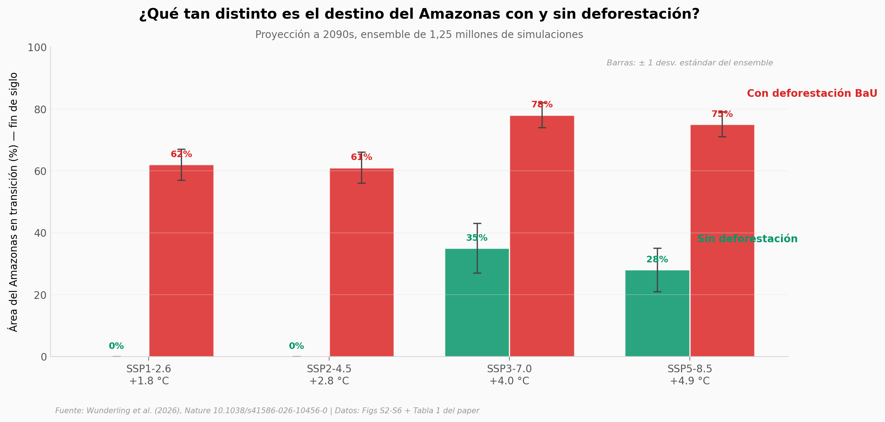

# La deforestación baja el umbral climático del Amazonas en 2 °C (según el modelo)

Un modelo dinámico del Amazonas (PyCascades) corrió 1,25 millones de simulaciones para estimar a qué calentamiento global el bioma entra en transición sistémica. Sin deforestación, el umbral está entre **3,7 y 4,0 °C**. Con la deforestación de tipo *Business as Usual* (22-28 % del bioma), el umbral baja a **1,5–1,9 °C** — exactamente el rango donde apunta la meta del Acuerdo de París.

**El hallazgo:** En SSP1-2.6 (calentamiento de +1,8 °C), el modelo proyecta **0 % del Amazonas en transición sin deforestación** y **62 % con deforestación BaU**. La diferencia, 62 puntos porcentuales, depende solo del escenario de uso del suelo.

## Gráfica clave



## Reproducir

[](https://colab.research.google.com/github/Ciencia-a-Mordiscos/lab/blob/main/papers/2026-05-06-amazon-deforestacion-umbral/notebook.ipynb)

O localmente:

```bash
pip install pandas matplotlib numpy
jupyter execute notebook.ipynb
```

## Datos

Los CSVs son **valores reconstruidos a partir de las figuras y tabla 1 del paper** (el archivo de Figshare contiene el código del modelo PyCascades, no los resultados tabulados).

- `datos/transition_2090s_por_ssp.csv` — % área en transición a 2090s, con vs sin deforestación, por SSP. 4 filas, incluye desv. estándar.
- `datos/headline_thresholds.csv` — Umbrales de calentamiento crítico para cada escenario (con / sin deforestación).
- `datos/decadal_map_only.csv` — Evolución década a década del % en transición cuando se aísla el motor MAP (lluvia anual). 16 filas (SSP2-4.5 y SSP3-7.0 × 8 décadas).
- `datos/decadal_mcwd_only.csv` — Igual que el anterior pero para MCWD (déficit acumulado en estación seca).
- `datos/ssp_defor_2090.csv` — Escenario alternativo: deforestación moderada (≈20-25 %) en 2090s.
- `datos/umbrales_criticos.csv` — Umbrales hidrológicos absolutos (MAP y MCWD) en mm/año.

## Links

- **Video:** [Pendiente]
- **Paper:** Wunderling, N. *et al.* (2026). *Deforestation-induced drying lowers Amazon climate threshold*. **Nature**. DOI: [10.1038/s41586-026-10456-0](https://doi.org/10.1038/s41586-026-10456-0)
- **Código del modelo:** [Figshare archive](https://doi.org/10.6084/m9.figshare.28191128) — PyCascades + escenarios SSP land-use (550 MB).
- **Escenario BaU de deforestación:** [Soares-Filho et al. (2013), ORNL DAAC](https://doi.org/10.3334/ORNLDAAC/1153)
