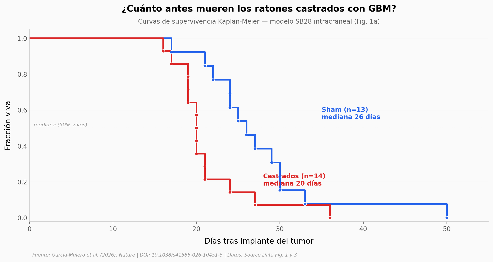

# La sorpresa de los andrógenos en el cerebro

En la mayoría de los cánceres los andrógenos ayudan al tumor — por eso bloquearlos es estándar contra el cáncer de próstata. En el cerebro, este equipo demostró lo contrario: castrar ratones con glioblastoma les acortó la supervivencia mediana un 23%, y bloquear glucocorticoides con mifepristona revirtió el daño. En una cohorte retrospectiva de 1.272 hombres con glioblastoma, los que recibieron testosterona suplementada tuvieron 38% menos riesgo de morir.

**El hallazgo:** **la castración hiperactiva el eje hipotálamo-pituitaria-adrenal, suelta cortisol/glucocorticoides, y eso apaga la respuesta inmune que ataca al tumor — un mecanismo específico de tumores cerebrales que invierte la lógica usual de los andrógenos en cáncer.**

## Gráfica clave



## Reproducir

[](https://colab.research.google.com/github/Ciencia-a-Mordiscos/lab/blob/main/papers/2026-05-06-androgenos-glioblastoma-hpa/notebook.ipynb)

O localmente:

```bash
pip install pandas matplotlib numpy scipy
jupyter execute notebook.ipynb
```

## Datos

- `datos/gbm_survival_sb28.csv` — 27 ratones (Sham n=13, Castrados n=14), días de supervivencia con GBM intracraneal (SB28). Source Data Fig. 1a del paper.
- `datos/mfp_rescue_castrated.csv` — 20 ratones castrados con GBM (Vehículo n=10, Mifepristona n=10), días de supervivencia. Source Data Fig. 3b.

## Links

- **Video:** [Pendiente]
- **Paper:** [Nature — DOI: 10.1038/s41586-026-10451-5](https://doi.org/10.1038/s41586-026-10451-5)
- **Datos originales:** Source Data del paper (Supplementary Information).
