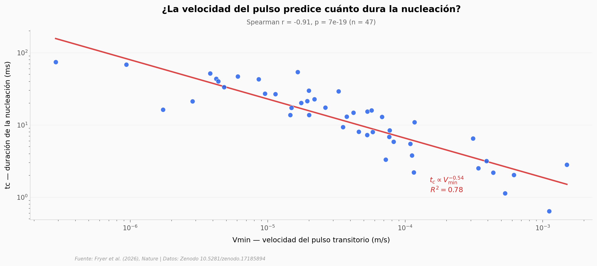

# Cómo se decide un terremoto en 15 milisegundos

Un equipo midió 64 eventos de nucleación en una falla artificial bajo cinco niveles de presión normal. La pregunta: ¿hay alguna variable que prediga cuándo va a romper la falla? La respuesta resultó ser una sola — la velocidad del pulso transitorio que aparece al inicio de la nucleación.

**El hallazgo:** **Vmin** (la velocidad mínima del deslizamiento durante la nucleación) explica el 78 por ciento de la varianza en la duración del evento (tc), con correlación de Spearman r = -0,91 sobre 47 eventos. El rango de Vmin cubre 5.224 veces — y aun así el ajuste se sostiene. Un 26,6 por ciento de los eventos arrestan sin completar la nucleación.

## Gráfica clave



## Reproducir

[](https://colab.research.google.com/github/Ciencia-a-Mordiscos/lab/blob/main/papers/2026-05-06-foreshocks-nucleacion-terremotos/notebook.ipynb)

O localmente:

```bash
pip install pandas matplotlib numpy scipy
jupyter execute notebook.ipynb
```

## Datos

- `datos/Laboratory_Results_Summary.csv` — 92 filas brutas, 64 eventos válidos. Columnas: Experiment, Event, presiones (Syy, Sxy), Lc [m], A0, tc [s], slip nucleation/foreshock, Vmin. **Atención:** las columnas que dicen `[micron]` están en metros — verificado dimensionalmente (Vmin × tc ≈ slip).

## Links

- **Video:** [Ver en YouTube](https://youtube.com/shorts/lvgNtmgpUq4)
- **Paper:** [Nature — DOI: 10.1038/s41586-026-10497-5](https://doi.org/10.1038/s41586-026-10497-5)
- **Datos originales:** [Zenodo 10.5281/zenodo.17185894](https://doi.org/10.5281/zenodo.17185894)
