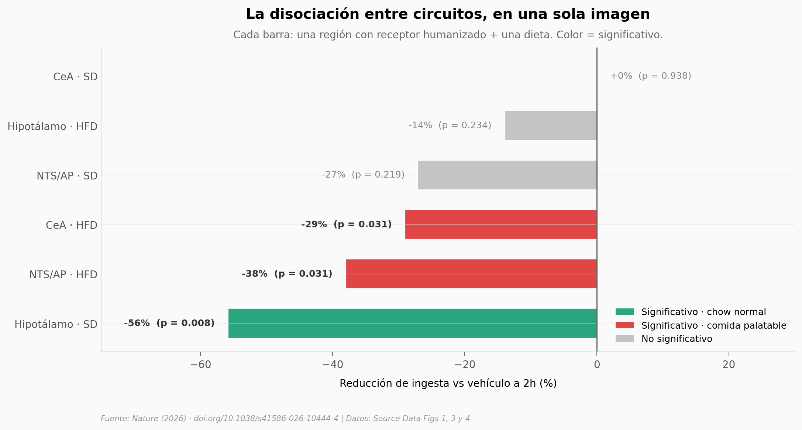

# Las píldoras anti-obesidad pasan por la amígdala

Las nuevas pastillas para perder peso (Danuglipron, Orforglipron) actúan sobre el mismo receptor que Ozempic — pero usan un circuito cerebral distinto. Reclutan una población de neuronas en la **amígdala central** que las inyectables apenas tocan, y desde ahí frenan específicamente la comida palatable, sin afectar la ingesta normal.

**El hallazgo:** **En ratones humanizados, devolver el receptor solo en la amígdala central basta para que Danuglipron reduzca la ingesta de comida palatable un 29% (p=0.031, d=-1.03 pareado, n=8) — sin tocar la ingesta de chow normal.**

## Gráfica clave



## Reproducir

[](https://colab.research.google.com/github/Ciencia-a-Mordiscos/lab/blob/main/papers/2026-05-06-glp1-amigdala-recompensa-ratones/notebook.ipynb)

O localmente:
```bash
pip install pandas matplotlib numpy scipy
jupyter execute notebook.ipynb
```

## Datos

- `datos/ingesta_droga_genotipo.csv` — Fig. 1 del paper. Ingesta acumulada (g) a 1h/2h/4h para Liraglutide, Danuglipron y Orforglipron en ratones WT y S33W (humanizados). n por grupo entre 8 y 16.
- `datos/fos_region_cerebral.csv` — Fig. 3 del paper. Activación neuronal (Fos+ normalizado) por región cerebral (DMH, NTS, AP, CeA) en WT vs S33W bajo Danuglipron. 121 ratones individuales.
- `datos/rescate_aav_completo.csv` — Fig. 4 del paper. Rescate AAV-hGlp1r región-específica (CeA, hipotálamo, DMH, NTS/AP) comparado con AAV-mCherry (control). Pareado Vehículo vs Danuglipron, dieta SD vs HFD.

## Links

- **Video:** [Pendiente]
- **Paper:** [Nature — DOI: 10.1038/s41586-026-10444-4](https://doi.org/10.1038/s41586-026-10444-4)
- **Datos originales:** Source Data Figures 1, 3 y 4 del paper (Supplementary del mismo DOI).
