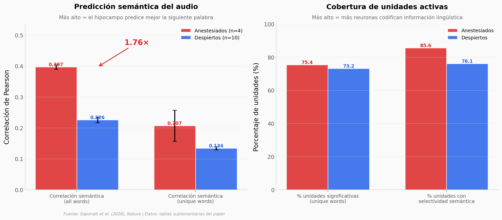

# Hipocampo bajo anestesia: oddball, plasticidad y predicción semántica

Bajo anestesia general no hay consciencia. No hay dolor, no hay recuerdo. Pero el hipocampo de pacientes anestesiados con propofol siguió discriminando sonidos raros, aprendiendo en tiempo real, y prediciendo la siguiente palabra de un audio que se reprodujo durante la cirugía.

**El hallazgo:** En la correlación semántica all-words, los pacientes anestesiados (n=4, 368 unidades) tuvieron **0.397** vs **0.226** en pacientes despiertos (n=10, 356 unidades) — un factor de 1.76×. La señal sensorial compleja no se apaga cuando se apaga la consciencia.

## Gráfica clave



## Reproducir

[](https://colab.research.google.com/github/Ciencia-a-Mordiscos/lab/blob/main/papers/2026-05-06-hipocampo-anestesia-lenguaje/notebook.ipynb)

O localmente:
```bash
pip install pandas matplotlib numpy
jupyter execute notebook.ipynb
```

## Datos

Las 6 tablas vienen del paper y de su material suplementario:

- `datos/comparacion_anaesth_awake.csv` — 10 métricas pareadas anaesth vs awake (correlaciones semánticas, % unidades significativas, τ predicción)
- `datos/lfp_encoding_por_banda.csv` — % canales LFP con encoding significativo en 6 bandas (delta a high_gamma)
- `datos/plasticity_slopes_por_banda.csv` — pendientes de decoding tono/oddball por banda con p-values
- `datos/svm_decoding_accuracy.csv` — accuracy de SVM (10-fold CV) por método y paciente
- `datos/cohorte.csv` — 7 pacientes (3 oddball + 4 lenguaje), unidades y palabras
- `datos/categorias_codificadas_por_unidad.csv` — distribución de unidades por # de categorías semánticas

## Limitaciones del análisis

- n=7 pacientes, todos con epilepsia tratada quirúrgicamente.
- Solo propofol — los autores declaran que no generaliza a otras anestesias.
- La comparación anaesth vs awake usa hardware distinto (Neuropixels en anestesiados, microcables EMU en despiertos): es informativa, no controlada.
- Las cifras son visualizaciones de los números reportados en el paper, no un re-análisis.

## Links

- **Video:** Pendiente
- **Paper:** [Plasticity and language in the anaesthetized human hippocampus — Nature, 2026](https://doi.org/10.1038/s41586-026-10448-0)
- **Material suplementario:** [Springer MOESM](https://static-content.springer.com/esm/art%3A10.1038%2Fs41586-026-10448-0/MediaObjects/41586_2026_10448_MOESM1_ESM.pdf)
- **Código del paper:** [github.com/NuttidaLab/rnn_oddball](https://github.com/NuttidaLab/rnn_oddball)
- **Datos crudos:** [DABI U01NS108923](https://dabi.loni.usc.edu/dsi/U01NS108923)
