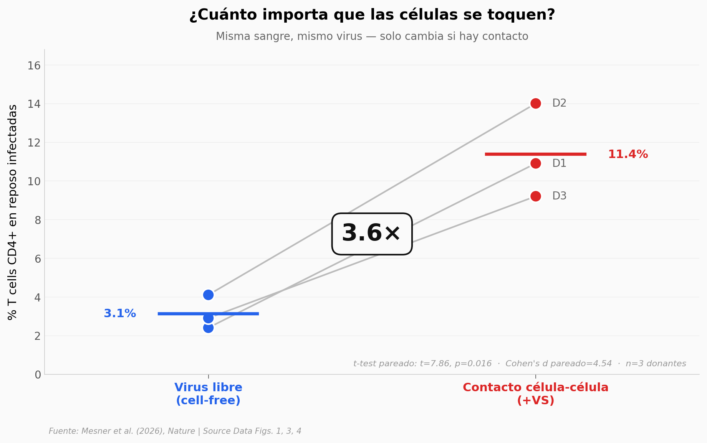

# El HIV necesita tocar células para infectarlas

Los linfocitos T CD4+ en reposo son refractarios al virus libre, pero el HIV se encuentra en ellos en el cuerpo. La diferencia: el contacto célula-célula activa una cascada de señalización que culmina en CDK1 fosforilando nucleoporinas específicas, lo que abre el poro nuclear para la cápside del virus.

**El hallazgo:** **3,6×** más infección con contacto célula-célula que con virus libre. Silenciar CDK1 reduce la infección **−33%**. De 10 nucleoporinas medidas, solo **3 cambian** con el contacto (Nup54 +32%, Nup62 +16%, Tpr +12%).

## Gráfica clave



## Reproducir

[](https://colab.research.google.com/github/Ciencia-a-Mordiscos/lab/blob/main/papers/2026-05-06-hiv-poros-nucleares-infeccion/notebook.ipynb)

O localmente:

```bash
pip install pandas matplotlib numpy scipy
jupyter execute notebook.ipynb
```

## Datos

- `datos/cellfree_vs_cellcell.csv` — 3 donantes humanos, % T cells CD4+ infectadas en virus libre vs contacto célula-célula (Fig. 1u del paper)
- `datos/knockdown_cdk1.csv` — 3 donantes × 3 condiciones (sin tratar, control siRNA, CDK1 silenciado), señal de infección (Fig. 3u)
- `datos/nup_phosphorylation.csv` — 10 nucleoporinas × 2 condiciones (+VS, -VS) × ~50 mediciones por condición, intensidad relativa de fosforilación (Fig. 4c)

## Links

- **Video:** [Pendiente]
- **Paper:** [Nature — DOI: 10.1038/s41586-026-10453-3](https://doi.org/10.1038/s41586-026-10453-3)
- **Datos originales:** Source Data del paper en Nature (MOESM7, MOESM9, MOESM10)
