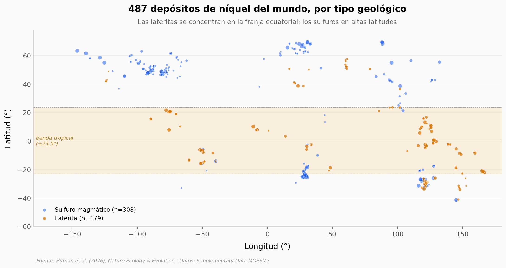

# El níquel para descarbonizar y los trópicos

487 depósitos de níquel mapeados por los autores de un paper de Nature Ecology & Evolution. Su modelo proyecta que entre el 78% y el 83% del níquel extraído hasta 2050 vendrá de lateritas tropicales — el mismo tipo de mina que vive desproporcionadamente en costas y zonas de alta biodiversidad.

**El hallazgo:** **Las lateritas son tropicales (mediana de latitud −1,4°), costeras (55% a ≤50 km del mar) y económicamente atractivas (grado mediano 1,11% Ni vs 0,54% en sulfuros, mineral mediano 45 Mt vs 13 Mt). Por eso el modelo PEMMSS las prioriza primero.**

## Gráfica clave



## Reproducir

[](https://colab.research.google.com/github/Ciencia-a-Mordiscos/lab/blob/main/papers/2026-05-06-niquel-tropical-conservacion/notebook.ipynb)

O localmente:
```bash
pip install pandas matplotlib numpy scipy
jupyter execute notebook.ipynb
```

## Datos

- `datos/minas_niquel_PEMMSS.csv` — 487 depósitos de níquel (179 lateritas + 308 sulfuros magmáticos), 36 columnas: id, nombre, tipo de depósito, recurso remanente, capacidad de producción, status, año descubrimiento, probabilidad de desarrollo, grado, recovery, costos/revenue del modelo PEMMSS, latitud/longitud, valor de prioridad terrestre (Jung et al. 2021), valor de prioridad marina a 50 km (Sala et al. 2021).

## Links

- **Video:** [Pendiente]
- **Paper:** [Hyman et al. (2026), Nature Ecology & Evolution — DOI: 10.1038/s41559-026-03068-4](https://doi.org/10.1038/s41559-026-03068-4)
- **Datos originales:** [Springer Supplementary Data MOESM3](https://static-content.springer.com/esm/art%3A10.1038%2Fs41559-026-03068-4/MediaObjects/41559_2026_3068_MOESM3_ESM.zip)
- **Modelo PEMMSS v1.4.0:** [Zenodo (Northey et al.)](https://doi.org/10.5281/zenodo.16792366)
