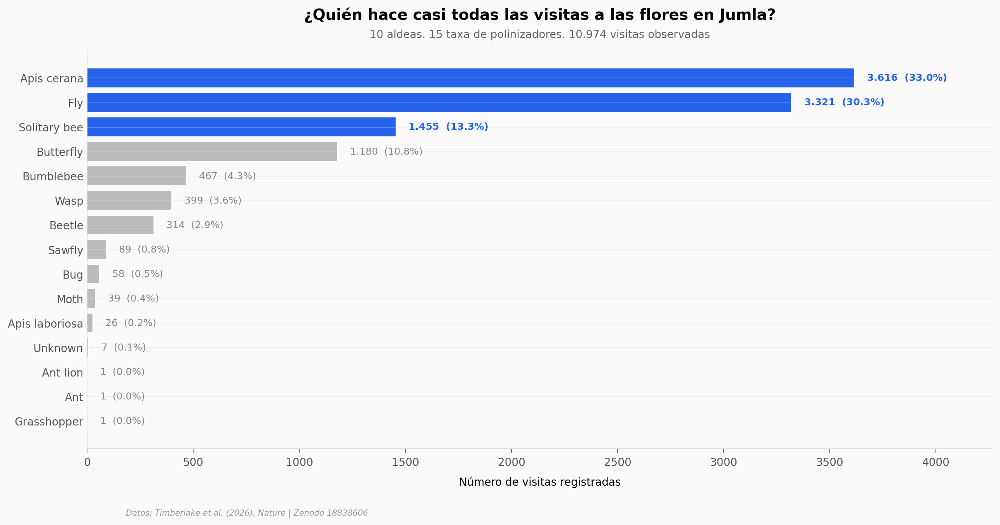

# Polinizadores y nutrición en Nepal

En 10 aldeas del distrito de Jumla, en el Himalaya nepalí, un equipo registró 10.974 visitas de insectos a flores en 51 cultivos distintos. La estructura ecológica de esa red está extremadamente concentrada: solo tres taxa de polinizadores hacen el 76,5% de las visitas, y dentro de ellos *Apis cerana* — la abeja de la miel asiática — concentra una de cada tres. Cuando se cruza esa red con la dependencia de polinización de cada cultivo, aparecen 9 cultivos cuya producción depende ≥85% de los insectos. Bajo el escenario hipotético de pérdida total de polinizadores, el rendimiento de los 29 cultivos modelados caería en promedio 59%.

**El hallazgo:** **Tres taxa de polinizadores sostienen el 76,5% de las visitas a 51 cultivos en Jumla, Nepal — y nueve de esos cultivos dependen ≥85% de la polinización para producir.**

## Gráficas clave



## Reproducir

[](https://colab.research.google.com/github/Ciencia-a-Mordiscos/lab/blob/main/papers/2026-05-06-polinizadores-nutricion-nepal/notebook.ipynb)

O localmente:

```bash
pip install pandas matplotlib numpy
jupyter execute notebook.ipynb
```

## Datos

- `datos/visits_by_pollinator.csv` — 15 taxa de polinizadores con visitas, especies de planta visitadas y aldeas.
- `datos/yield_scenarios.csv` — 29 cultivos con dependencia de polinización + escenarios de yield (pérdida total + declive con IC95).
- `datos/crop_visits_summary.csv` — 51 cultivos con polinizador top y diversidad de visitantes.
- `datos/crop_x_pollinator_long.csv` — formato long de visitas por cultivo × taxa para los 10 cultivos más visitados.
- `datos/pollen_capacity_OTU.csv` — capacidad de carga de polen por OTU/taxa (contexto).

Todos los CSVs son derivados procesados de [Zenodo 18838606](https://zenodo.org/records/18838606) (CC-BY-4.0). El dataset dietético individual del paper (776 MB en Git LFS) no se incluye — los headlines del 44% del ingreso y 20% del consumo de vitamina A/folato/E se citan al paper, no se reproducen aquí.

## Links

- **Video:** [Pendiente]
- **Paper:** [Nature — DOI: 10.1038/s41586-026-10421-x](https://doi.org/10.1038/s41586-026-10421-x)
- **Datos originales:** [Zenodo 18838606](https://zenodo.org/records/18838606)
- **Código original (R):** [tom-timberlake/micropoll_main](https://github.com/tom-timberlake/micropoll_main)
