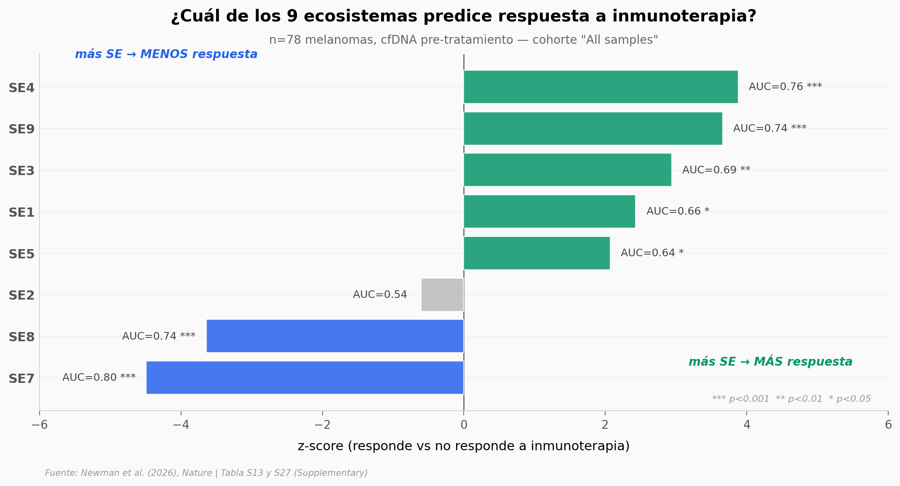

# Una gota de sangre que predice si la inmunoterapia funcionará

78 pacientes con melanoma metastásico, una muestra de sangre antes de empezar el tratamiento, y un número calculado desde fragmentos de ADN flotando libres en el plasma. Ese número —SE7— predijo quién respondería a la inmunoterapia con un AUC de 0.80. Sin biopsia. Sin tomografía. Solo sangre.

**El hallazgo:** **El equipo identificó 9 ecosistemas espaciales (SEs) en el microambiente tumoral integrando >10 millones de transcriptomas. Esos ecosistemas se recuperan desde plasma con cfDNA, y SE7 + SE4 medidos en sangre predicen respuesta a inmunoterapia (AUC 0.80 y 0.76) en 78 melanomas pre-tratamiento.**

## Gráfica clave



## Reproducir

[](https://colab.research.google.com/github/Ciencia-a-Mordiscos/lab/blob/main/papers/2026-05-06-tme-spatial-ecotypes/notebook.ipynb)

O localmente:
```bash
pip install pandas matplotlib numpy
jupyter execute notebook.ipynb
```

## Datos

- `datos/se_abundance_tcga.csv` — 7.076 muestras TCGA × 9 SEs × 17 tipos de cáncer. Proporciones de cada ecosistema espacial por tumor. Fuente: Supplementary Table 13 del paper.
- `datos/liquid_se_ici_response.csv` — 35 filas (9 SEs × 10 subgrupos clínicos) en 78 melanomas pre-ICI. Columnas: data_group, n_samples, SE, z_score, p_value, auc. Fuente: Supplementary Table 27.

## Links

- **Video:** [Ver en YouTube](https://youtube.com/shorts/HsOg6AocG50)
- **Paper:** [Nature — DOI: 10.1038/s41586-026-10452-4](https://doi.org/10.1038/s41586-026-10452-4)
- **Datos originales:** [Nature Supplementary Materials (MOESM3)](https://static-content.springer.com/esm/art%3A10.1038%2Fs41586-026-10452-4/MediaObjects/41586_2026_10452_MOESM3_ESM.xlsx) · [GEO GSE320042](https://www.ncbi.nlm.nih.gov/geo/query/acc.cgi?acc=GSE320042) · [Stanford / Redivis](https://doi.org/10.25936/pm3t-cn37) · [Código en GitHub](https://github.com/digitalcytometry/spatialecotyper)
