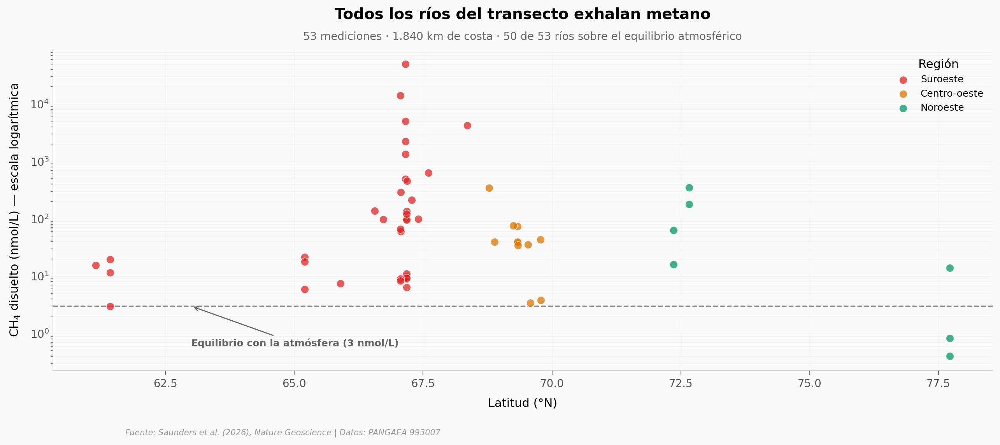

# El metano que respira Groenlandia se cocinó hace 2.000 años

Bajo el hielo del oeste de Groenlandia, microbios fabrican metano a partir de materia orgánica antigua. El equipo muestreó 96 puntos en 26 ríos durante 3 veranos, y midió la concentración de CH₄, su firma isotópica y la edad del carbono que lo formó.

**El hallazgo:** **el 94% de los ríos están supersaturados respecto a la atmósfera** (50 de 53 mediciones por encima del equilibrio), y las 7 muestras datadas dan edades del carbono entre **1,5 y 4,1 mil años atrás** — ninguna cae dentro del óptimo cálido del Holoceno (5–11 ka).

## Gráfica clave



## Reproducir

[](https://colab.research.google.com/github/Ciencia-a-Mordiscos/lab/blob/main/papers/2026-05-07-metano-subglacial-groenlandia/notebook.ipynb)

O localmente:
```bash
pip install pandas matplotlib numpy scipy
jupyter execute notebook.ipynb
```

## Datos

- `datos/ch4_concentraciones.csv` — 53 mediciones de CH₄ disuelto + química acuática + isótopos (n=16 con δ¹³C y δD)
- `datos/edades_radiocarbono.csv` — 7 muestras datadas por ¹⁴C (pMC corregido + edades cal BP)
- `datos/greenland_metano_completo.csv` — dataset completo: 96 mediciones × 30 columnas

## Links

- **Video:** [Pendiente]
- **Paper:** [Nature Geoscience — DOI: 10.1038/s41561-026-01976-5](https://doi.org/10.1038/s41561-026-01976-5)
- **Datos originales:** [PANGAEA 993007](https://doi.org/10.1594/PANGAEA.993007) (CC-BY 4.0)
