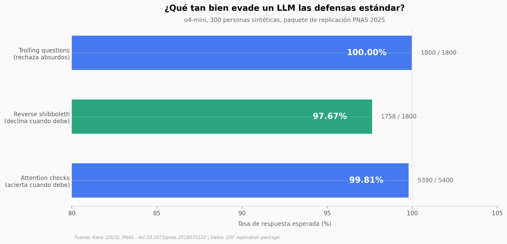

# Un LLM pasó 5.390 de 5.400 preguntas trampa de encuestas online

Las defensas estándar de las encuestas online — attention checks, reverse shibboleth, trolling questions — fueron diseñadas asumiendo que solo un humano puede responder de forma coherente. Un paper de PNAS (2025) puso 300 personas sintéticas levantadas con o4-mini frente a esas tres defensas. El bot acertó el 99,81% donde debía acertar, declinó el 97,67% donde un humano declinaría y rechazó el 100% de las preguntas absurdas.

**El hallazgo:** La triple coherencia — acertar, declinar y rechazar como humano al mismo tiempo — vuelve obsoletos los métodos de detección actuales. **De las 21 tareas testeadas, una sola (cálculo matemático, 88,3% decline) queda por debajo del 95%.**

## Gráfica clave



## Reproducir

[](https://colab.research.google.com/github/Ciencia-a-Mordiscos/lab/blob/main/papers/2026-05-08-llm-evade-anti-bots-encuestas/notebook.ipynb)

O localmente:

```bash
pip install pandas matplotlib numpy
jupyter execute notebook.ipynb
```

## Datos

- `datos/attention_checks_por_pregunta.csv` — 18 filas (9 preguntas × 2 experimentos), 600 trials por pregunta. Pass rate por pregunta.
- `datos/shibboleth_por_tarea.csv` — 6 tareas (citar la Constitución, traducir mandarín, FORTRAN, etc.), 300 trials cada una. Decline rate por tarea.
- `datos/trolling_por_pregunta.csv` — 6 preguntas absurdas (¿fue presidente?, ¿pasó dos semanas sin dormir?), 300 trials cada una. No rate por pregunta.

Total: 21 tareas, 9.000 trials. Tasas pre-agregadas tomadas del paquete de replicación OSF.

## Links

- **Video:** [Pendiente]
- **Paper:** [Kane (2025), *PNAS* — DOI: 10.1073/pnas.2518075122](https://doi.org/10.1073/pnas.2518075122)
- **Datos originales:** [OSF replication package](https://osf.io/ektqr/?view_only=c75f58815f804164a6a7685bff7f1800)
