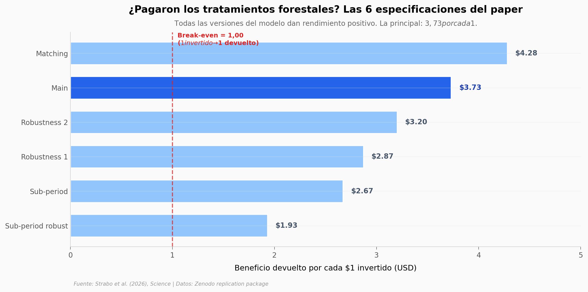

# Cuánto pagó limpiar bosques antes del fuego: $1 → $3,73

Un siglo de apagar todo lo que arde acumuló combustible en los bosques del oeste de Estados Unidos. Los **tratamientos forestales** (*fuel treatments*) — quemas controladas, raleos, podas — buscan reducir ese combustible antes de que un fuego llegue. La pregunta del paper es directa: *¿pagan?*

**El hallazgo:** **cada $1 invertido en tratamientos devolvió $3,73 en beneficios** (rango de robustez: $1,93 – $4,28 según la especificación). Total: **$2.800 millones en daños evitados** entre 2017 y 2023, bajo un diseño cuasi-experimental sobre 700 tratamientos cruzados con incendios reales.

## Gráfica clave



Las 6 versiones del modelo dan rendimiento positivo. La principal: $3,73 por cada $1.

## Reproducir

[](https://colab.research.google.com/github/Ciencia-a-Mordiscos/lab/blob/main/papers/2026-05-10-fuel-treatments-cost/notebook.ipynb)

O localmente:

```bash
pip install pandas matplotlib numpy
jupyter execute notebook.ipynb
```

## Datos

Cinco CSVs procesados (extraídos del replication package de 6,5 GB en Zenodo):

- `datos/bcr_robustness.csv` — los 6 BCR del paper (Main DiD + 5 robustez)
- `datos/top_treated_fires.csv` — top 15 incendios por número de tratamientos cruzados
- `datos/fire_emissions.csv` — 666 incendios con CO₂ y PM2.5 (2017-2023)
- `datos/fire_smoke_health.csv` — 473 incendios con muertes atribuidas por humo (Wen et al. 2023)
- `datos/mtbs_annual_fires.csv` — universo MTBS 2006-2023 (9.863 incendios)

## Links

- **Video:** *[Pendiente]*
- **Paper:** [*Wildfire damages and the cost-effective role of forest fuel treatments*](https://doi.org/10.1126/science.aea6463) — *Science*, 2026
- **Datos originales:** [Replication package en Zenodo](https://doi.org/10.5281/zenodo.18882334)
