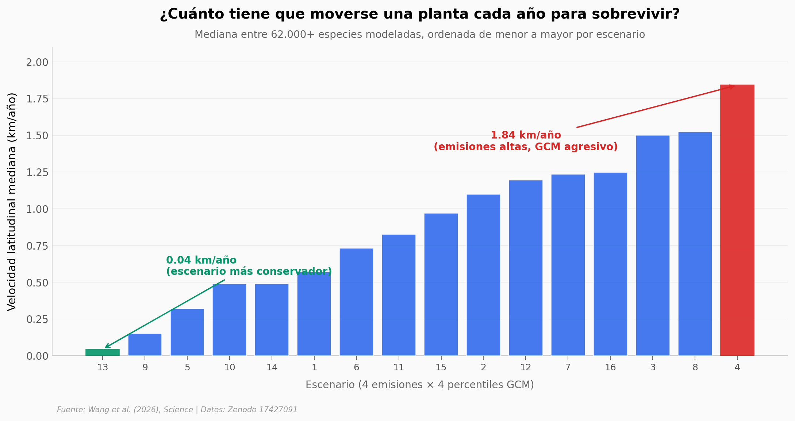

# Plantas que no pueden seguirle el paso al clima

Las plantas necesitarían moverse hasta **1,84 km al norte cada año** durante 80 años para mantener su clima actual bajo el peor escenario de emisiones. La mayoría no puede. Un equipo combinó la base de datos BioShifts (14.488 observaciones, 6.579 especies) con 6,8 millones de registros de ocurrencia y proyecciones de 10 modelos climáticos para mapear hábitats actuales y futuros en cuadrículas de 8 × 8 km para 67.664 especies de plantas.

**El hallazgo:** **El modelo proyecta que entre 7 y 16% de las especies modeladas perderían más del 90% de su rango para 2081–2100, y 70–80% de esas pérdidas vendrían de hábitats que desaparecen, no de la incapacidad de moverse.**

## Gráfica clave



## Reproducir

[](https://colab.research.google.com/github/Ciencia-a-Mordiscos/lab/blob/main/papers/2026-05-10-rango-plantas-clima-extincion/notebook.ipynb)

O localmente:
```bash
pip install pandas matplotlib numpy
jupyter execute notebook.ipynb
```

## Datos

- `datos/shift_por_escenario.csv` — Lat50/Ele50 mediana por escenario climático (16 filas: 4 emisiones × 4 percentiles GCM).
- `datos/shift_por_growth_form.csv` — Velocidad mediana por forma de crecimiento (Herb, Shrub, Tree, Epiphyte, Grass, Succulent).
- `datos/shift_por_dispersal_escenario.csv` — Cross dispersal × escenario (7 modos × 16 escenarios).
- `datos/shift_por_edad_madurez.csv` — Velocidad por bin de edad de madurez reproductiva (<1 a >50 años).
- `datos/shift_rate_sample.csv` — Sample aleatorio (n=10.000, seed=42) de Species × dispersal × scenario × Lat50/Ele50.

Los 5 CSVs son agregados derivados del data record original de Zenodo (142 MB sin filtrar).

## Links

- **Video:** [Pendiente]
- **Paper:** [Science — DOI: 10.1126/science.aea1676](https://doi.org/10.1126/science.aea1676)
- **Datos originales:** [Zenodo record 17427091](https://doi.org/10.5281/zenodo.17427091)
