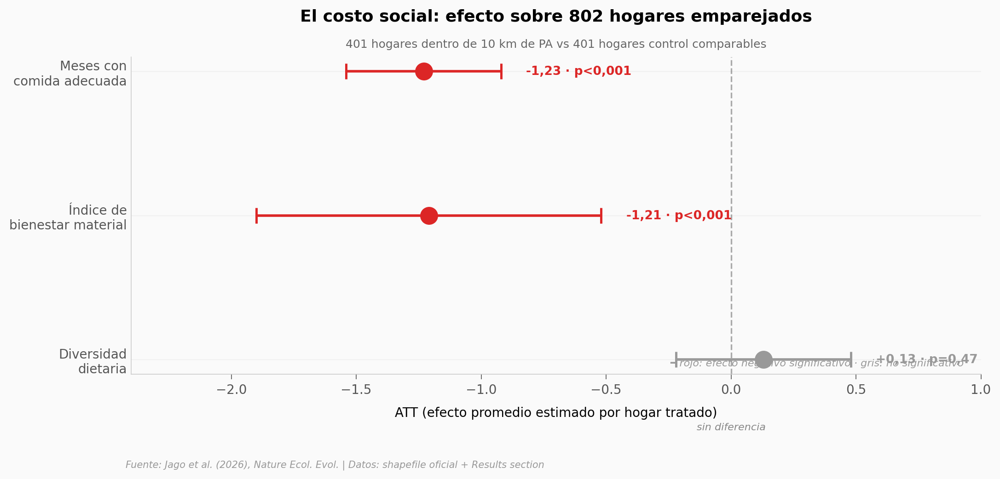

# Áreas protegidas de Etiopía: cuando proteger funciona y duele a la vez

Etiopía ha construido una red de áreas protegidas que cubre el 9,4% de su territorio. El paper de Jago et al. (2026) en *Nature Ecology & Evolution* hace tres cosas a la vez: mapea esa red, estima si realmente funciona (vía emparejamiento estadístico cuasi-experimental), y mide qué le cuesta socialmente a los hogares que viven cerca. El resultado: las áreas estrictas reducen la expansión agrícola un 44% y mantienen los pastizales (+76%), pero los hogares dentro de 10 km terminan con ~1,23 meses menos de comida adecuada al año.

**El hallazgo:** 68% de las áreas protegidas evaluadas muestran trade-off entre conservación ambiental y bienestar humano. Solo el 20% son win-win en ambos frentes. Proyectado a escala nacional, eso son ~3,9 millones de hogar-meses de comida adecuada perdidos (CI 2,9–4,9 M).

## Gráfica clave



## Reproducir

[](https://colab.research.google.com/github/Ciencia-a-Mordiscos/lab/blob/main/papers/2026-05-12-areas-protegidas-etiopia-tradeoffs/notebook.ipynb)

O localmente:
```bash
pip install pandas matplotlib numpy
jupyter execute notebook.ipynb
```

## Datos

- `datos/pas_metadata.csv` — 79 áreas protegidas con metadata oficial (designación, año, IUCN, área km²). Extraído del shapefile Sep 2024 publicado por los autores.
- `datos/effectiveness_atts.csv` — 6 filas: ATTs ambientales con CI 95% y % relativos (strict vs less-strict × forest_loss/agricultural_expansion/grassland).
- `datos/wellbeing_atts.csv` — 3 outcomes sociales (meses de comida adecuada, índice material, diversidad dietaria) con CI 95% y p-values, n=802 hogares emparejados.
- `datos/tradeoffs_summary.csv` — clasificación trade-off de 25 PAs evaluadas en los 6 outcomes.
- `datos/stakeholder_priorities.csv` — encuesta a 37 profesionales conservacionistas (Kendall W=0,74).

## Links

- **Video corto:** [Pendiente]
- **Paper:** [*Nature Ecology & Evolution* — DOI: 10.1038/s41559-026-03047-9](https://doi.org/10.1038/s41559-026-03047-9)
- **Datos originales:** [GitHub SCJago/protected_area_performance](https://github.com/SCJago/protected_area_performance/tree/main/data)
