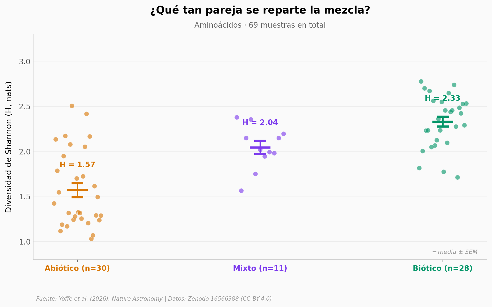

# Diversidad molecular como biosignatura: la vida se delata por cómo reparte sus aminoácidos

Bennu — la roca traída por OSIRIS-REx en 2023 — tiene 27 tipos de aminoácidos. Más que muchos microbios vivos. Y, aún así, es abiótica. ¿Por qué? Porque uno solo (glicina) ocupa el 64% de la fracción y aplasta a los demás. Un paper en *Nature Astronomy* propone usar esa diferencia — el reparto, no el conteo — para distinguir vida de no-vida con datos que cualquier misión planetaria ya puede producir.

**El hallazgo:** sobre 69 muestras (30 abióticas, 28 bióticas, 11 mixtas), la **diversidad de Shannon** de aminoácidos separa los grupos con un Cohen's d = 2,06 (Mann-Whitney U one-sided, p = 3,8 × 10⁻⁸). La paradoja: las muestras abióticas tienen, en promedio, **más tipos** de aminoácidos (16,3 vs 14,1) — pero la vida los reparte parejo.

## Gráfica clave



## Reproducir

[](https://colab.research.google.com/github/Ciencia-a-Mordiscos/lab/blob/main/papers/2026-05-12-diversidad-molecular-biosignatura/notebook.ipynb)

O localmente:
```bash
pip install pandas matplotlib numpy scipy
jupyter execute notebook.ipynb
```

## Datos

- `datos/AA_abundances.csv` — abundancias de 44 aminoácidos en 69 muestras (Zenodo 16566388)
- `datos/AA_uncertainties.csv` — incertidumbres asociadas
- `datos/FA_abundances.csv` — abundancias de 39 ácidos grasos en 34 muestras
- `datos/FA_uncertainties.csv` — incertidumbres
- `datos/AA_diversity_per_sample.csv` — entropía de Shannon por muestra (derivado)
- `datos/FA_diversity_per_sample.csv` — entropía de Shannon por muestra (derivado)

## Links

- **Video:** [Pendiente]
- **Paper:** [Yoffe et al. (2026), *Nature Astronomy* — DOI 10.1038/s41550-026-02864-z](https://doi.org/10.1038/s41550-026-02864-z)
- **Datos originales:** [Zenodo — DOI 10.5281/zenodo.16566388](https://doi.org/10.5281/zenodo.16566388) (CC-BY-4.0)
