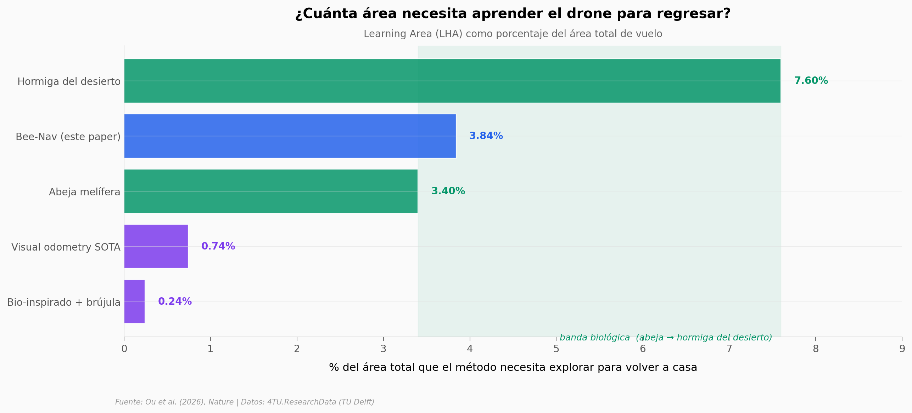

# Un drone vuelve a casa con una red de 3,4 kB

Un equipo de TU Delft entrenó un drone Crazyflie de 32 gramos para regresar a casa después de vuelos de hasta 600 m, sin GPS y con una red neuronal de 3,4 kB. La inspiración: el *learning flight* de la abeja melífera, esos vuelos en espiral que las recién nacidas hacen alrededor de la colmena. El drone solo necesita explorar el **3,84% del área total** de vuelo — muy cerca del 3,4% estimado para abejas y por debajo del 7,6% de las hormigas del desierto.

**El hallazgo:** Bee-Nav navega vuelos de 30 a 110 m con éxito del 100% usando una red de 3,4 kB (147× más pequeña que el estado del arte para drones diminutos, que necesita 500 kB para cubrir 4×5 m). En vuelos largos (200–600 m) la red de atención de 42,3 kB mantiene un 70% de éxito incluso con condiciones variables de viento.

## Gráfica clave



## Reproducir

[](https://colab.research.google.com/github/Ciencia-a-Mordiscos/lab/blob/main/papers/2026-05-13-bee-nav-navegacion-drones-abejas/notebook.ipynb)

O localmente:
```bash
pip install pandas matplotlib numpy
jupyter execute notebook.ipynb
```

## Datos

- `datos/lha_por_metodo.csv` — LHA% por método de path integration (5 filas: drone real, SVO+GTSAM, bio-inspirado+brújula, abeja, hormiga del desierto).
- `datos/redes_neuronales.csv` — Tamaño y capas de las dos redes Bee-Nav vs SOTA tiny drone (3 filas).
- `datos/homing_por_ambiente.csv` — Tasa de éxito de homing en 6 ambientes reales (CyberZoo, indoor hall, outdoor cortos, outdoor largos con/sin viento).
- `datos/visual_homing_simulacion.csv` — Configuración y métricas de las 800 simulaciones en 10 bosques sintéticos.

> El raw dataset completo (716 MB con flight logs PX4 .ulg, imágenes omnidireccionales y ROS2 bags) está en [4TU.ResearchData](https://doi.org/10.4121/a0217a20-0443-48b2-8a04-9609ac267029). Para este notebook construimos CSVs pequeños desde los valores cuantitativos publicados en el texto del paper Open Access.

## Links

- **Video:** [Pendiente]
- **Paper:** [Ou et al. (2026), *Nature* — DOI: 10.1038/s41586-026-10461-3](https://doi.org/10.1038/s41586-026-10461-3)
- **Datos originales:** [4TU.ResearchData (TU Delft)](https://doi.org/10.4121/a0217a20-0443-48b2-8a04-9609ac267029)
