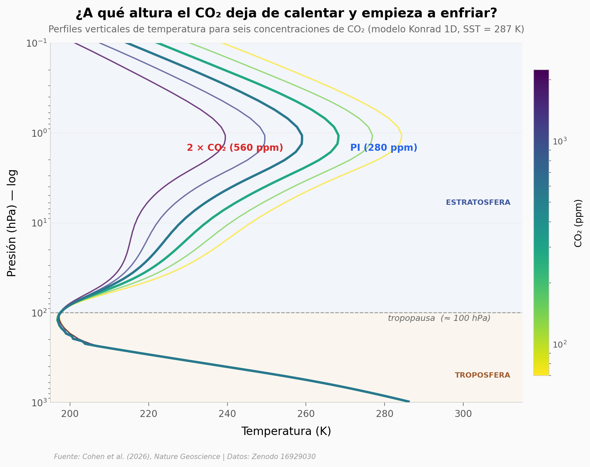

# El CO₂ enfría la estratosfera (y eso amplifica su forzamiento)

El CO₂ no solo calienta la superficie — enfría la estratosfera. Y ese enfriamiento, lejos de ser un efecto secundario, **amplifica el propio efecto invernadero del CO₂** en el tope de la atmósfera. Cohen et al. (2026) usan un modelo radiativo idealizado (Konrad 1D) corrido a 6 concentraciones de CO₂ (70 → 2240 ppm) y lo cruzan con 36 modelos CMIP6 + 3 reanálisis observacionales para explicar el mecanismo espectroscópico detrás de esta huella vertical característica.

**El hallazgo:** **A 48 km de altura cada duplicación de CO₂ enfría la estratopausa ~9 K**, y ese enfriamiento añade entre 50 % y 70 % de forzamiento radiativo extra al efecto directo del CO₂. La tropopausa, mientras tanto, no se mueve: la temperatura a 100 hPa varía menos de 0,3 K entre 70 y 2240 ppm.

## Gráfica clave



## Reproducir

[](https://colab.research.google.com/github/Ciencia-a-Mordiscos/lab/blob/main/papers/2026-05-13-co2-enfria-estratosfera/notebook.ipynb)

O localmente:
```bash
pip install pandas matplotlib numpy
jupyter execute notebook.ipynb
```

## Datos

Todos los archivos son extractos pre-procesados de los NetCDFs originales de Zenodo (5,1 GB). Lo que ves aquí son las series ya agregadas a CSV ligero (< 200 KB total) para que el notebook corra en cualquier laptop sin descargar nada.

- `datos/konrad_perfil_temperatura.csv` — perfiles verticales de temperatura del modelo Konrad 1D para 6 escenarios CO₂ × 128 niveles verticales (de superficie a 0,1 hPa).
- `datos/cmip6_tendencia_vertical.csv` — tendencias decadales (K/década, 1980-2019) de temperatura en 36 modelos CMIP6 + 3 reanálisis (ERA5, JRA-55, MERRA-2) por nivel de presión.
- `datos/tasas_calentamiento_por_especie.csv` — tasas radiativas (K/día) por especie (CO₂, H₂O, O₃) en estado base pre-industrial 287 K.
- `datos/forzamiento_espectral_2xco2.csv` — IRF/ERF resueltos por número de onda (cm⁻¹) para 2 × CO₂.
- `datos/forzamiento_vs_doubling.csv` — IRF, ERF y % de amplificación estratosférica para 5 factores de CO₂ (¼×, ½×, 2×, 4×, 8× PI).
- `datos/forzamiento_vs_sst.csv` — IRF, ERF y % de amplificación para 7 valores de SST (247 → 307 K).

## Links

- **Video:** [Pendiente]
- **Paper:** [Cohen et al. (2026) · *Nature Geoscience* · DOI: 10.1038/s41561-026-01965-8](https://doi.org/10.1038/s41561-026-01965-8)
- **Datos originales:** [Zenodo 16929030 — Raw data and plotting code](https://doi.org/10.5281/zenodo.16929030)

---

*Notebook generado para el canal Ciencia a Mordiscos — [cienciaamordiscos.com](https://cienciaamordiscos.com) · Repo: [github.com/Ciencia-a-Mordiscos/lab](https://github.com/Ciencia-a-Mordiscos/lab)*
