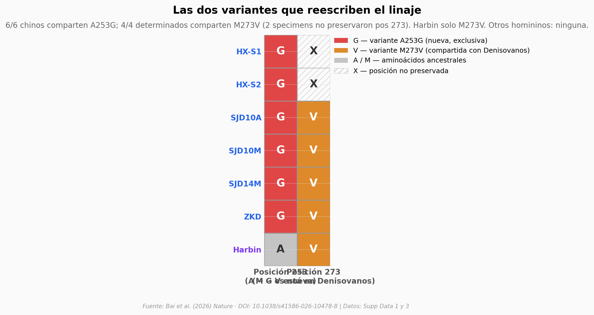

# Proteínas de esmalte de 6 Homo erectus chinos revelan una variante única

El equipo extrajo proteínas dentales fosilizadas de 6 *Homo erectus* chinos de ~400 mil años y comparó sus secuencias con todos los homininos conocidos. Encontraron una variante en la ameloblastina (A253G) que no aparece en ningún otro linaje humano — y otra variante (M273V) que solo comparten con Denisovanos. Es un puente molecular tendido en piedra.

**El hallazgo:** **6/6 chinos comparten la variante A253G**, exclusiva de este linaje. **4/4 chinos determinados comparten M273V** con Denisovanos. Las dos variantes apuntan a que la introgresión super-arcaica en el genoma de Denisovanos probablemente vino de poblaciones relacionadas con *H. erectus*.

## Gráfica clave



## Reproducir

[](https://colab.research.google.com/github/Ciencia-a-Mordiscos/lab/blob/main/papers/2026-05-13-homo-erectus-china-esmalte/notebook.ipynb)

O localmente:
```bash
pip install pandas matplotlib numpy scipy
jupyter execute notebook.ipynb
```

## Datos

- `datos/screening_resumen_sitio.csv` — Tasa de éxito MALDI por sitio (3 filas: Zhoukoudian, Hexian, Sunjiadong)
- `datos/screening_maldi.csv` — Resultado MALDI individual de los 85 fósiles probados
- `datos/cobertura_secuencias.csv` — Cobertura proteómica por proteína × specimen (40 filas, 8 proteínas dentales)
- `datos/variantes_ambn.csv` — Aminoácidos en posiciones 253 y 273 de AMBN para los 7 specimens
- `datos/similaridad_genomica_cr4.csv` — Similaridad genómica por ventana de 20 kb en cr4 71.4–71.7 Mb (127 ventanas)

## Links

- **Video:** [Pendiente]
- **Paper:** [Nature — DOI: 10.1038/s41586-026-10478-8](https://doi.org/10.1038/s41586-026-10478-8)
- **Datos crudos (MS):** [ProteomeXchange PXD068897](https://www.ebi.ac.uk/pride/archive/projects/PXD068897)
- **Dataset de referencia paleoproteómica:** [Zenodo 7728060](https://doi.org/10.5281/zenodo.7728060)
