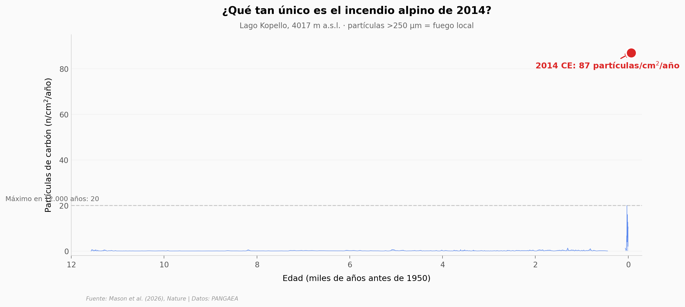

# El primer incendio alpino del siglo XXI en los Rwenzori — en 12.000 años

En 2014, los incendios alcanzaron una elevación de los montes Rwenzori (4.017 m) donde no se había registrado fuego local de magnitud equivalente en 12.000 años. Reconstruimos el registro desde dos lagos a distintas alturas y comparamos: en el lago alpino el pico de 2014 alcanzó 87 partículas de carbón por cm² por año, más de cuatro veces el máximo histórico (20 part/cm²/año). En el lago de bosque (2.990 m), el fuego ya se había multiplicado por 5,5 hace 2.000 años, junto con un giro de la vegetación hacia gramíneas.

**El hallazgo:** **el pico de fuego en 2014 a 4.017 m es 4,35× más alto que cualquier registro de los 12.000 años anteriores en ese mismo lago** — y 223× la media histórica.

## Gráfica clave



## Reproducir

[](https://colab.research.google.com/github/Ciencia-a-Mordiscos/lab/blob/main/papers/2026-05-13-incendios-alpinos-rwenzori-12mil/notebook.ipynb)

O localmente:
```bash
pip install pandas matplotlib numpy
jupyter execute notebook.ipynb
```

## Datos

- `datos/kopello_charcoal.csv` — Lago Kopello (4.017 m, alpino). 493 muestras, tasa de acumulación de carbón macroscópico (>250 µm). Rango: −0,072 a 11,577 ka BP (BP = antes de 1950).
- `datos/mahoma_charcoal.csv` — Lago Mahoma (2.990 m, bosque). 328 muestras, mismo proxy. Rango: 0,367 a 12,436 ka BP.
- `datos/mahoma_pollen.csv` — Lago Mahoma, porcentaje de polen de tres taxones (*Celtis africana*, Poaceae, *Podocarpus*). 63 muestras. Rango: 0,461 a 12,071 ka BP.

## Links

- **Video:** [Pendiente]
- **Paper:** [Nature — DOI: 10.1038/s41586-026-10511-w](https://doi.org/10.1038/s41586-026-10511-w)
- **Datos originales:** [PANGAEA — Lake Kopello](https://doi.pangaea.de/10.1594/PANGAEA.987871) · [Lake Mahoma charcoal](https://doi.pangaea.de/10.1594/PANGAEA.987874) · [Lake Mahoma pollen](https://doi.pangaea.de/10.1594/PANGAEA.987876)
