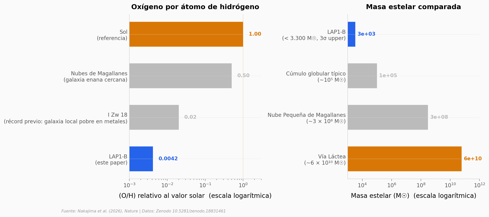

# LAP1-B: la galaxia más químicamente primitiva conocida

Cuando el universo tenía apenas 800 millones de años, una galaxia ultra-débil se estaba formando con menos del 1% del oxígeno que tiene el Sol. El James Webb la detectó gracias a una lente gravitacional que la amplifica 98 veces. Sin esa lente, no habríamos sabido que existía.

**El hallazgo:** **LAP1-B muestra una abundancia de oxígeno de (4,2 ± 1,8) × 10⁻³ veces el valor solar** — unas 240 veces menos oxígeno por átomo de hidrógeno que el sistema solar. Es la galaxia formadora de estrellas más químicamente primitiva conocida hasta la fecha.

## Gráfica clave



## Reproducir

[](https://colab.research.google.com/github/Ciencia-a-Mordiscos/lab/blob/main/papers/2026-05-13-lap1-b-galaxia-reionizacion/notebook.ipynb)

O localmente:

```bash
pip install pandas matplotlib numpy
jupyter execute notebook.ipynb
```

## Datos

- `datos/lap1b_spectrum.csv` — Espectro 1D NIRSpec/PRISM (3.092 puntos, 0,76–5,20 μm)
- `datos/lap1b_emission_lines.csv` — 9 líneas analizadas (Lyα → Hα), 4 detectadas con S/N ≥ 3
- `datos/lap1b_key_parameters.csv` — 16 parámetros físicos del paper + Supplementary Information

## Links

- **Video:** [Pendiente]
- **Paper:** Nakajima et al. (2026). *An ultra-faint, chemically primitive galaxy forming in the reionization era.* Nature. [DOI: 10.1038/s41586-026-10374-1](https://doi.org/10.1038/s41586-026-10374-1)
- **Datos originales:** [Zenodo 10.5281/zenodo.18831461](https://doi.org/10.5281/zenodo.18831461) (CC-BY-4.0)
