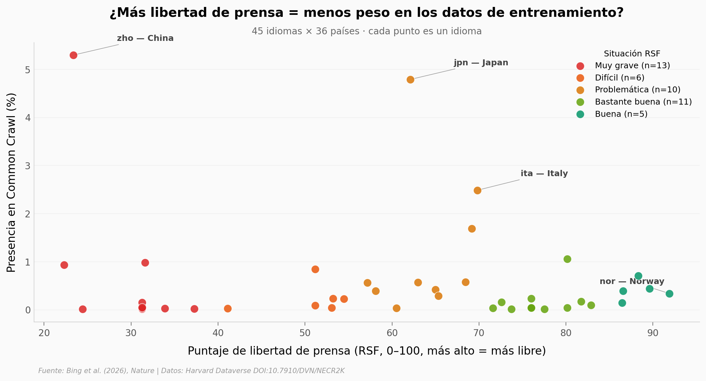

# LLMs y control estatal de medios

¿De qué idiomas aprenden los modelos grandes de lenguaje? Bing et al. (2026, *Nature*) auditan 45 idiomas en 36 países y encuentran un patrón inquietante: los LLMs comerciales tienden a sonar más pro-gobierno en idiomas de países con menos libertad de prensa. Este Lab replica el mapa observacional que abre el estudio — sin pretender resolver la pregunta causal, que el paper sostiene con un experimento de fine-tuning aparte.

**El hallazgo:** El chino representa el **5.30% de Common Crawl** (base de entrenamiento más usada por los LLMs). El noruego, el **0.33%**. China y Noruega están en extremos opuestos del puntaje de libertad de prensa de RSF (23 vs 92 sobre 100). Pero la correlación cruda en el dataset (Spearman ρ=0.215, p=0.156) **NO es significativa** — y, si quitamos el chino, el patrón se invierte: más libertad de prensa se asocia con MÁS peso en Common Crawl.

## Gráfica clave



## Reproducir

[](https://colab.research.google.com/github/Ciencia-a-Mordiscos/lab/blob/main/papers/2026-05-13-llm-control-estatal-medios/notebook.ipynb)

O localmente:
```bash
pip install pandas matplotlib numpy scipy
jupyter execute notebook.ipynb
```

## Datos

- `datos/idiomas_pais_rsf.csv` — 45 idiomas (ISO 639-3) × 11 columnas: país asignado, score RSF de libertad de prensa, categoría de situación, porcentaje en Common Crawl, población hablante.
- `datos/prompts_auditoria.csv` — 261 prompts bilingües (inglés + chino) usados en la auditoría de modelos comerciales: 8 países foco × 3 tipos (líderes, instituciones, países).

## Links

- **Video:** [Pendiente]
- **Paper:** [State media control influences large language models — Nature, DOI: 10.1038/s41586-026-10506-7](https://doi.org/10.1038/s41586-026-10506-7)
- **Datos originales:** [Harvard Dataverse — Replication Data (CC0)](https://doi.org/10.7910/DVN/NECR2K)
