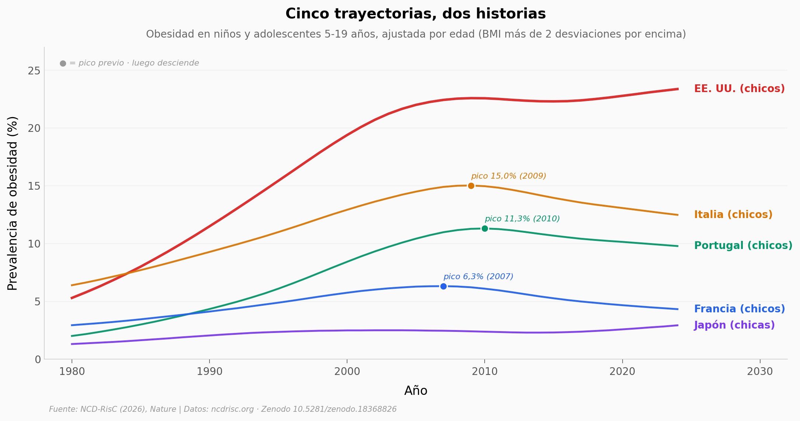

# La obesidad mundial: dónde se freno, dónde se aceleró

El consorcio NCD-RisC reunió **4.050 estudios poblacionales** con altura y peso medidos (no autoreportados) de **232 millones** de personas en **200 países** entre 1980 y 2024. La curva del mundo sigue subiendo, pero ya no es la misma curva en todos lados: en algunos países ricos los niños bajaron desde el pico, mientras América Latina, Sur de Asia y África subsahariana aceleran.

**El hallazgo:** **La obesidad infantil ya cayó desde su pico en Italia, Francia y Portugal** — Francia es el caso más claro, con una caída relativa cercana al 32% desde 2007. En cambio, la tasa anual de aumento en mujeres adultas de Sur de Asia se **triplicó** entre 1980-2000 y 2000-2024, y en Latinoamérica subió de 0,45 a 0,70 puntos porcentuales por año.

## Gráfica clave



## Reproducir

[](https://colab.research.google.com/github/Ciencia-a-Mordiscos/lab/blob/main/papers/2026-05-13-obesidad-platea-vs-acelera/notebook.ipynb)

O localmente:
```bash
pip install pandas matplotlib numpy
jupyter execute notebook.ipynb
```

## Datos

Todos los datasets vienen del NCD-RisC (ncdrisc.org), modelo bayesiano jerárquico con estandarización por edad e intervalos de incertidumbre 95%.

- `datos/obesidad_adultos_mundo.csv` — agregado mundial adultos ≥20 años (Women/Men), 1980-2024
- `datos/obesidad_ninos_mundo_edad10.csv` — agregado mundial niños 10 años (Boys/Girls), 1980-2024
- `datos/obesidad_adultos_pais.csv` — 200 países × año × sexo, adultos
- `datos/obesidad_ninos_pais.csv` — 200 países × año × sexo, niños/adolescentes 5-19 años
- `datos/obesidad_regiones.csv` — 8 regiones × año × sexo × grupo de edad
- `datos/estudios_por_anio.csv` — número de estudios fuente por año (1975-2025)

## Links

- **Video:** Pendiente
- **Paper:** [Obesity rise plateaus in developed nations and accelerates in developing nations — *Nature* 2026, DOI: 10.1038/s41586-026-10383-0](https://doi.org/10.1038/s41586-026-10383-0)
- **Datos originales:** [NCD-RisC adiposity data downloads](https://ncdrisc.org/data-downloads-adiposity.html) · [Zenodo 10.5281/zenodo.18368826](https://doi.org/10.5281/zenodo.18368826)
