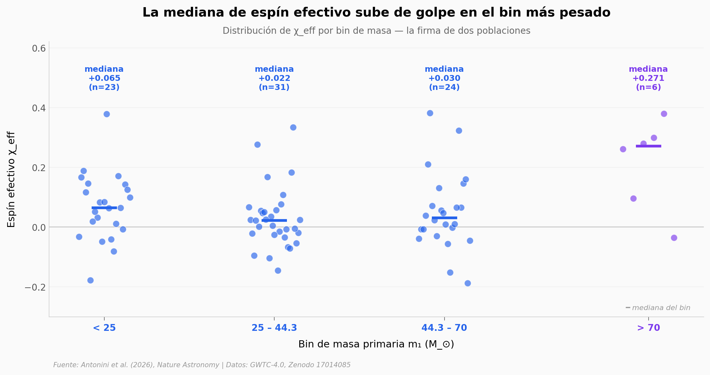

# Agujeros negros donde no deberían existir

La inestabilidad de pares debería impedir que el colapso directo de una estrella forme agujeros negros entre ~50 y ~130 M_⊙ — el llamado *mass gap*. Pero LIGO-Virgo-KAGRA sigue detectando fusiones de agujeros negros con masas que caen justo dentro de esa zona. Este notebook explora las 84 fusiones de agujeros negros nuevas de GWTC-4.0 (catálogo O4a, septiembre 2025) para ver qué tan poblada está la zona del gap y qué tienen de raro los agujeros más masivos.

**El hallazgo:** Los seis agujeros con m₁ > 70 M_⊙ tienen una **mediana de espín efectivo de +0.27** — nueve veces más que el resto del catálogo (+0.03). La probabilidad de obtener esa mediana por azar es ≈ 0.0006 (bootstrap, 10 000 muestreos).

## Gráfica clave



## Reproducir

[](https://colab.research.google.com/github/Ciencia-a-Mordiscos/lab/blob/main/papers/2026-05-13-pair-instability-mass-gap/notebook.ipynb)

O localmente:
```bash
pip install pandas matplotlib numpy scipy
jupyter execute notebook.ipynb
```

## Datos

- `datos/gwtc4_o4a_bbh.csv` — 84 BBHs del catálogo O4a (GWTC-4.0). Subconjunto preferido por evento (NRSur7dq4 si disponible, else Mixed), filtrado a binarias de agujeros negros (m₂ > 3 M_⊙). 14 columnas con medianas y CIs al 90% de masa, espín efectivo, distancia y SNR.

## Links

- **Video:** [Ver en YouTube](https://youtube.com/shorts/WEzTR0A4EXA)
- **Paper:** [Nature Astronomy — DOI: 10.1038/s41550-026-02847-0](https://doi.org/10.1038/s41550-026-02847-0)
- **Datos originales:** [GWTC-4.0 PE Summary Table (Zenodo 17014085)](https://doi.org/10.5281/zenodo.17014085)
