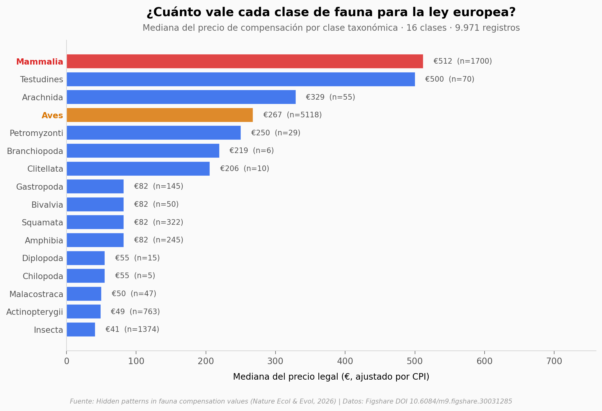

# El precio oculto de la fauna en Europa

Las leyes europeas asignan precios oficiales a cada especie para calcular multas y compensaciones. Un lince ibérico vale €93.884 para la ley española. Un caracol, €82. Y el orden del precio se predice mejor por la **clase taxonómica** y la **lentitud reproductiva** que por el riesgo de extinción. Lo que parecía un sistema basado en ecología resulta tener sesgos taxonómicos y biológicos que nadie había medido antes a escala europea.

**El hallazgo:** **Mamíferos cobran 7,1× más que el resto de fauna y aves 3,7× más** (test Mann-Whitney p ≈ 10⁻²³³ y 10⁻²⁶¹). Entre rasgos biológicos, la duración generacional es la correlación más fuerte (ρ Spearman ≈ 0,36 según el paper). La categoría IUCN influye pero **no es estrictamente monotónica**: las especies *En peligro* (€443) reciben más que las *En peligro crítico* (€358).

## Gráfica clave



## Reproducir

[](https://colab.research.google.com/github/Ciencia-a-Mordiscos/lab/blob/main/papers/2026-05-13-precio-fauna-europa/notebook.ipynb)

O localmente:
```bash
pip install pandas matplotlib numpy scipy
jupyter execute notebook.ipynb
```

## Datos

Cinco CSVs pre-agregados, extraídos del *Dataset.xlsx* publicado en Figshare (CC BY 4.0):

- `datos/precio_por_clase.csv` — 16 clases taxonómicas con mediana, IQR y máximo del precio.
- `datos/precio_por_pais.csv` — 24 países con mediana, media y rango de precios.
- `datos/precio_por_iucn.csv` — 7 categorías IUCN (CR, EN, VU, NT, LC, DD, NE).
- `datos/precio_por_generacion.csv` — 6 bins de duración generacional (<1 año a >20 años).
- `datos/precio_vs_masa.csv` — 6.790 entradas a nivel especie con `adult_body_mass_g`, `gen_length_y`, `iucn_red_list`, `country` y `price_cpi_eur`.

## Links

- **Video:** [Pendiente]
- **Paper:** [Hidden patterns in fauna compensation values in European biodiversity legislation](https://doi.org/10.1038/s41559-026-03067-5) — *Nature Ecology & Evolution*, 2026.
- **Datos originales:** [Figshare DOI 10.6084/m9.figshare.30031285](https://doi.org/10.6084/m9.figshare.30031285)
