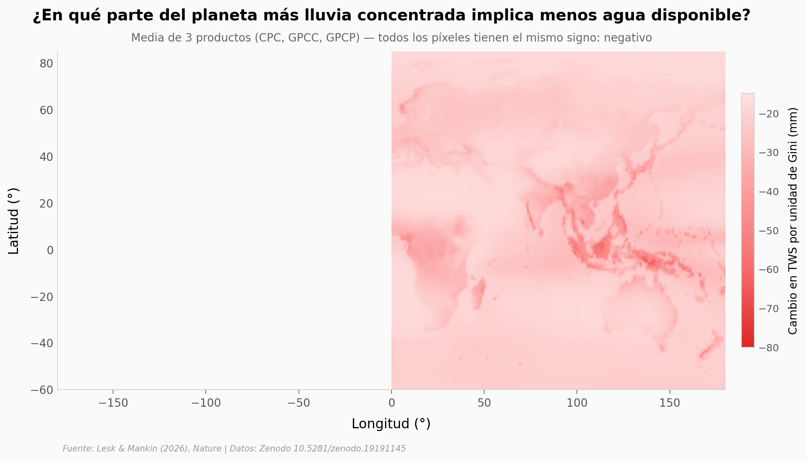

# El 100% del planeta responde igual a la lluvia más concentrada: con menos agua

Cuando la lluvia se concentra en menos eventos más intensos —y no solo cae más o menos en total— las reservas hídricas terrestres caen. En **todas** las celdas del land surface global (n=259.200), en los tres productos de precipitación independientes (CPC, GPCC, GPCP), durante 1980-2022.

**El hallazgo:** El efecto secante de la concentración (Gini) tiene magnitud **comparable** al efecto humectante de la precipitación total (ratio |coef_Gp|/|coef_P| = 0.35-0.81, media ≈0.59 según producto). Y proyectando a +2°C de calentamiento, la concentración Gini sube en 100% del land surface (mediana +0.0315 /K).

## Gráfica clave



## Reproducir

[](https://colab.research.google.com/github/Ciencia-a-Mordiscos/lab/blob/main/papers/2026-05-13-precipitacion-concentrada-agua/notebook.ipynb)

O localmente:
```bash
pip install pandas matplotlib numpy scipy
jupyter execute notebook.ipynb
```

## Datos

- `datos/basin_models_no_interaction.csv` — regresiones panel por cuenca (n=494, R² mediana 0.92)
- `datos/dTWS_dGp_3product_mean.npz` — mapa global 0.5° del cambio en TWS por unidad de Gini (media 3 productos)
- `datos/projections_dGp_GPCP_int_7pct_K.npz` — proyección dGp/K en simulación idealizada +7%/K
- `datos/{CPC,GPCC,GPCP}_std_regression_results.csv` — regresión global estandarizada por producto

## Links

- **Video:** [Pendiente]
- **Paper:** [Lesk & Mankin (2026) — Nature](https://doi.org/10.1038/s41586-026-10487-7)
- **Datos originales:** [Zenodo replicación](https://doi.org/10.5281/zenodo.19191145)
