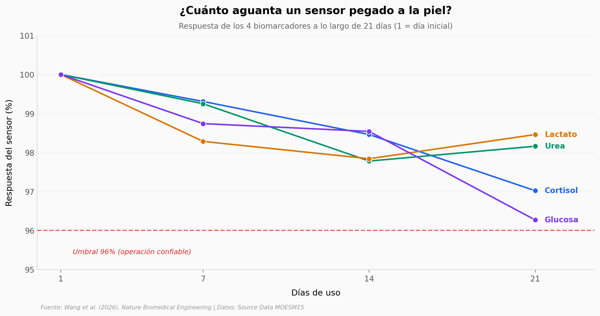

# Sensor de sudor multimodal: 4 biomarcadores en 21 días

Un sensor electroquímico inalámbrico, sin batería, que mide cortisol, urea, lactato y glucosa al mismo tiempo en sudor — y se autolimpia con un pulso de voltaje cuando los electrodos se saturan. Probado durante 21 días en laboratorio y en 3 humanos para detectar el aumento de cortisol con el estrés.

**El hallazgo:** Los 4 biomarcadores se mantienen entre **96.27% y 98.46%** de respuesta al día 21 — pérdida máxima de **3.73 puntos** sin intervención manual. La regeneración recupera **100% (etapa 1)** y **≥98.94% (etapa 2)** de la corriente base. En 3 participantes, el cortisol sube **+35.2% medio** (3/3 consistente, Cohen's d pareado = 10.46, Wilcoxon p=0.25 limitado por n=3).

## Gráfica clave



## Reproducir

[](https://colab.research.google.com/github/Ciencia-a-Mordiscos/lab/blob/main/papers/2026-05-13-sensor-sudor-multimodal/notebook.ipynb)

O localmente:
```bash
pip install pandas matplotlib numpy scipy
jupyter execute notebook.ipynb
```

## Datos

- `datos/estabilidad_21dias.csv` — Respuesta de 4 sensores en días 1, 7, 14 y 21 (en % relativo al día 1)
- `datos/recuperacion_etapa1.csv` — Recuperación de corriente base tras 1ª regeneración, 3 batches
- `datos/recuperacion_etapa2.csv` — Recuperación tras 2ª regeneración, 3 batches
- `datos/metodos_regeneracion.csv` — Tiempo de regeneración por técnica electroquímica (CV, DPV, ECA, LSV)
- `datos/validacion_humana.csv` — Cortisol, urea, lactato, glucosa en 3 participantes (rest vs stress, 0h vs 2h)
- `datos/estabilidad_temperatura.csv` — Corriente a 25°C vs 37°C
- `datos/estabilidad_ph.csv` — Corriente a pH 4.5 vs 6.5

## Links

- **Video:** [Pendiente]
- **Paper:** [Nature Biomedical Engineering — DOI: 10.1038/s41551-026-01670-2](https://doi.org/10.1038/s41551-026-01670-2)
- **Datos originales:** [Supplementary Data MOESM15](https://static-content.springer.com/esm/art%3A10.1038%2Fs41551-026-01670-2/MediaObjects/41551_2026_1670_MOESM15_ESM.xlsx)
