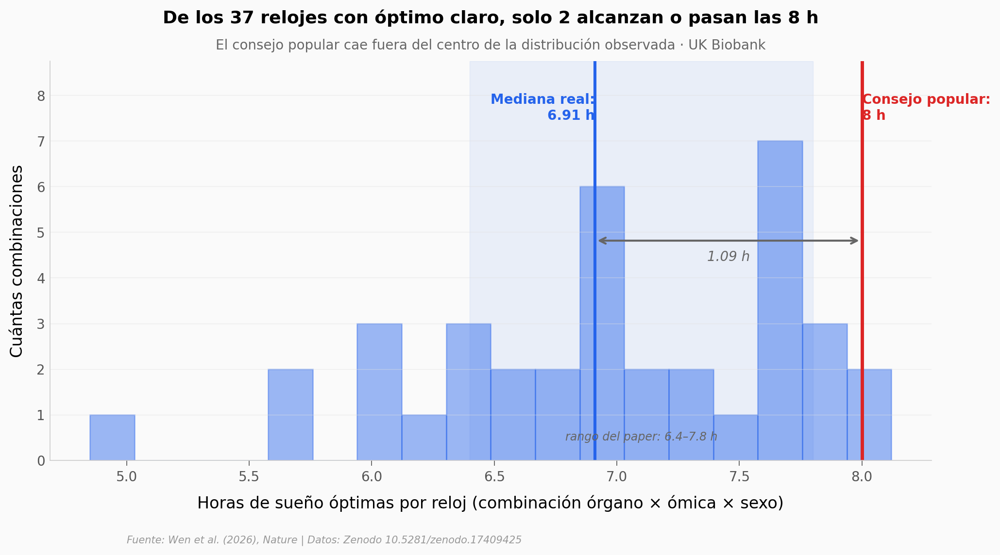

# ¿Cuántas horas debe dormir tu cuerpo?

Te dijeron que **8 horas**. Pero cuando se mide la edad biológica de 18 órganos distintos con tres tecnologías (MRI, proteómica plasmática, metabolómica), aparece una **U-shape**: dormir poco y dormir mucho se asocian con un mayor *gap* de edad biológica. Y el fondo de esa U no está en 8 h — está, según el órgano y la ómica, entre 4.9 y 8.1 h. La mediana es **6.91 h**.

**El hallazgo:** **De los 37 relojes biológicos con óptimo claro, solo 2 alcanzan o pasan las 8 h.** El consejo popular cae sistemáticamente fuera del rango (6.4–7.8 h) que reporta el paper.

> ⚠️ **Asociación, no causa.** El paper deja explícitamente abierta la causalidad inversa: que un órgano envejecido cambie los patrones de sueño, en lugar de que el sueño sea quien envejece el órgano.

## Gráfica clave



## Reproducir

[](https://colab.research.google.com/github/Ciencia-a-Mordiscos/lab/blob/main/papers/2026-05-13-sueno-relojes-biologicos-edad/notebook.ipynb)

O localmente:
```bash
pip install pandas matplotlib numpy scipy
jupyter execute notebook.ipynb
```

## Datos

- `datos/curvas_u_sueno_edad.csv` — 4 600 filas. 46 curvas U (23 combinaciones órgano × ómica × 2 sexos) modeladas con GAM, 100 puntos por curva entre 4 h y 10 h de sueño. Columnas: `organo`, `tecnologia` (MRI/Prot/Met), `sexo`, `horas_sueno`, `edad_biol_gap`, `gap_ci_inferior`, `gap_ci_superior`.
- `datos/optimo_sueno_por_organo.csv` — 46 filas. Resumen por combinación: `horas_optimo`, `gap_minimo`, `gap_4h`, `gap_10h`, `penalizacion_4h`, `penalizacion_10h`, `curva_U_interior` (True/False).

Ambos archivos se derivan de los datos publicados por Wen et al. en Zenodo (CC-BY 4.0).

## Links

- **Video:** [Pendiente]
- **Paper:** [Wen et al. (2026), Sleep chart of biological ageing clocks in middle and late life — Nature](https://doi.org/10.1038/s41586-026-10524-5)
- **Datos originales:** [Zenodo 10.5281/zenodo.17409425](https://doi.org/10.5281/zenodo.17409425)
- **Pipeline R del paper:** [SleepChart-R](https://github.com/anbai106/SleepChart)
