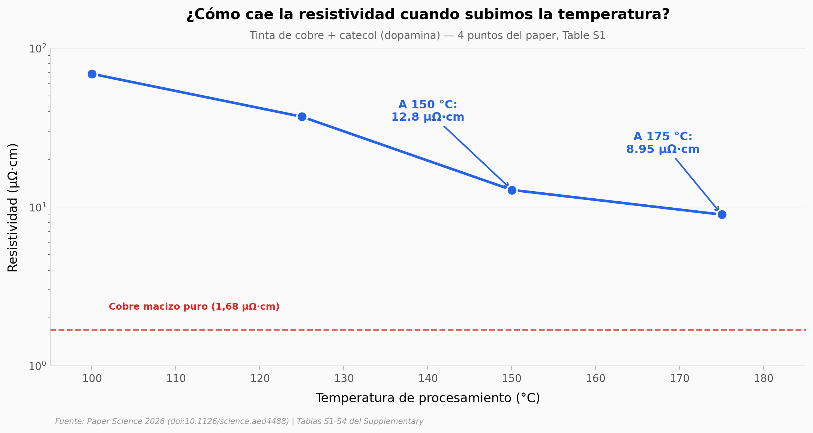

# Imprimir circuitos de cobre a 150 °C

Un equipo logró fundir nanopartículas de cobre en un conductor a **150 °C**, con resistividad **12,8 µΩ·cm** — cuatro veces mejor que cualquier otro método publicado que opere a esa temperatura, y muy por debajo de los 250 °C que pide la mediana de la literatura. El truco está en los catecoles: la misma familia química que la dopamina, capaz de reducir Cu²⁺ a Cu(0) y pasivar la superficie de las partículas al mismo tiempo.

**El hallazgo:** **12,8 µΩ·cm a 150 °C — 4× mejor que la mediana de los 3 métodos previos que operan a esa temperatura.**

## Gráfica clave



## Reproducir

[](https://colab.research.google.com/github/Ciencia-a-Mordiscos/lab/blob/main/papers/2026-05-14-cobre-corrosion-catecol/notebook.ipynb)

O localmente:

```bash
pip install pandas matplotlib numpy
jupyter execute notebook.ipynb
```

## Datos

- `datos/resistividad_vs_temperatura.csv` — Curva del nuevo método (4 puntos, 100-175 °C). Table S1.
- `datos/literatura_tintas_cobre.csv` — 30 métodos publicados (temperatura + resistividad). Table S2.
- `datos/dft_interacciones.csv` — Energías DFT Cu⁺–ligando para 5 moléculas. Table S3.
- `datos/exafs_coordinacion.csv` — Estructura local Cu-Cu medida por EXAFS, 4 muestras. Table S4.

## Links

- **Video:** [Pendiente]
- **Paper:** [Science — DOI: 10.1126/science.aed4488](https://doi.org/10.1126/science.aed4488)
- **Datos originales:** Tablas S1-S4 del Supplementary Materials del paper.
