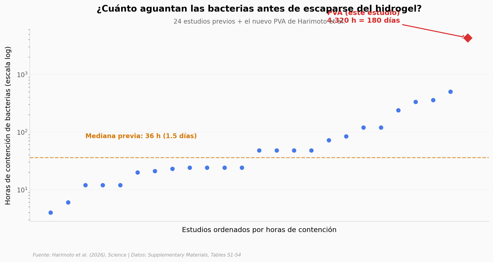

# Bacterias atrapadas seis meses: el hidrogel que no las deja escapar

Bacterias modificadas dentro del cuerpo que producen un medicamento a demanda y se quedan ahí seis meses sin escapar. Hasta ahora, la mediana de la literatura previa aguantaba apenas día y medio. El equipo de David Mooney en Harvard hizo un hidrogel de PVA que mueve la frontera dos órdenes de magnitud.

**El hallazgo:** **4.320 horas de contención (180 días)** — 120x sobre la mediana previa de 36 h, 8,6x sobre el mejor resultado anterior. Y la tenacidad del material es ~10.000 veces mejor que la del segundo material no-PVA.

## Gráfica clave



## Reproducir

[](https://colab.research.google.com/github/Ciencia-a-Mordiscos/lab/blob/main/papers/2026-05-14-hidrogel-bacterias-terapia/notebook.ipynb)

O localmente:

```bash
pip install pandas matplotlib numpy
jupyter execute notebook.ipynb
```

## Datos

Transcritos manualmente del Supplementary Materials PDF del paper (paywalled; SM accesible):

- `datos/containment_time.csv` — 25 filas. Horas de contención de bacterias en 24 estudios previos + este. Columnas: material, bacteria, application, media, containment_hours, leakage_marked, reference.
- `datos/mechanical_properties.csv` — 66 filas. Modulus (MPa) y Work of Fracture (J/m³) de 31 formulaciones PVA propias + 35 hidrogeles de literatura. Marca `approximate` para valores re-leídos de figuras.
- `datos/mutations_summary.csv` — 10 filas. Recuento de mutaciones por tipo (Point mismatch, Insertion, Deletions, Gene deletion, Frameshift, Silent) y elemento (CDS de ChPy vs Promoter).
- `datos/mutations_per_colony.csv` — 37 filas, 31 colonias únicas. Mutaciones por colonia y elemento.

## Limitaciones

- Seis meses en ratón no son seis meses en humano. Falta validación clínica.
- El 8% de deleciones de gen muestra que la función terapéutica caduca aunque la contención no.
- Una sola entrada de PVA frente a 24 previas — no es estadística inferencial, es una marca técnica nueva esperando replicación.
- Table S2 mezcla datos propios con valores leídos aproximadamente de figuras de papers anteriores (marcados en columna `approximate`).
- Discrepancia entre los resúmenes Table S4: por tipo de mutación suman 51, por colonia suman 59. Probable conteo distinto de eventos compuestos.

## Links

- **Video:** Pendiente
- **Paper:** [Science — DOI: 10.1126/science.aec2071](https://doi.org/10.1126/science.aec2071)
- **Supplementary Materials:** [PDF (75 pp)](https://www.science.org/doi/suppl/10.1126/science.aec2071/suppl_file/science.aec2071_sm.pdf)
