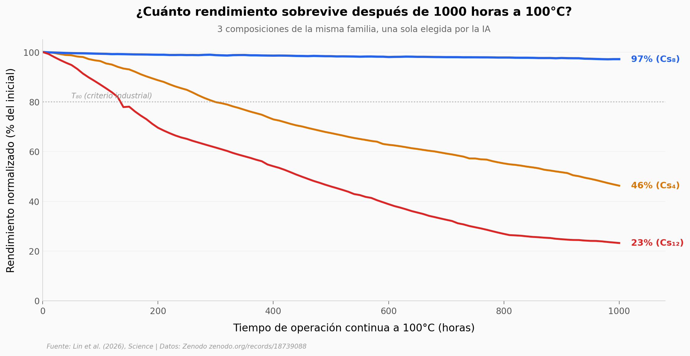

# Perovskita estable a 100°C: una IA de cuatro agentes encontró la receta

Hasta este trabajo, 49 de 51 estudios sobre estabilidad de perovskita testeaban a 85°C o menos. Subir el listón a 100°C — la temperatura que un panel solar real puede ver en techos en verano — quedaba como reto abierto. Un equipo del Laboratorio Nacional de Argonne y la Universidad de Toledo entrenó una IA de cuatro agentes para que diseñara, agente por agente, las tres piezas críticas del dispositivo: el absorbente, la capa que transporta huecos y la interfaz con los electrodos. La IA propuso un absorbente con 8% de cesio (FA₀.₉₂Cs₀.₀₈PbI₃). El equipo lo fabricó y midió.

**El hallazgo:** **97% del rendimiento inicial sobrevive 1000 horas de operación continua a 100°C.** La mejor referencia previa a esa temperatura caía a 60% — una diferencia de 37 puntos porcentuales.

## Gráfica clave



## Reproducir

[](https://colab.research.google.com/github/Ciencia-a-Mordiscos/lab/blob/main/papers/2026-05-14-perovskita-ia-multiagente-100c/notebook.ipynb)

O localmente:
```bash
pip install pandas matplotlib numpy scipy
jupyter execute notebook.ipynb
```

## Datos

- `datos/estabilidad_pce_100c.csv` — curva temporal de retención de rendimiento (PCE normalizado) para tres composiciones (Cs₄, Cs₈, Cs₁₂) a 100°C, 101 puntos de 0 a 1000 horas (Fig. 4D del paper).
- `datos/trap_density.csv` — densidad de trampas por composición (Cs₀, Cs₄, Cs₈, Cs₁₂), 3 réplicas (Fig. 2D).
- `datos/ai_prediccion_cs.csv` — predicción del agente AI (F4) vs validación experimental, con intervalo de confianza 80% (Fig. 2A).
- `datos/literatura_estabilidad.csv` — 51 estudios previos (44 DOIs únicos) con temperatura, tiempo y retención reportada.

## Links

- **Video:** [Ver en YouTube](https://youtube.com/shorts/IHgr_eflnHc)
- **Paper:** [Science — DOI: 10.1126/science.aef1620](https://doi.org/10.1126/science.aef1620)
- **Datos originales:** [Zenodo zenodo.org/records/18739088](https://doi.org/10.5281/zenodo.18739088)
