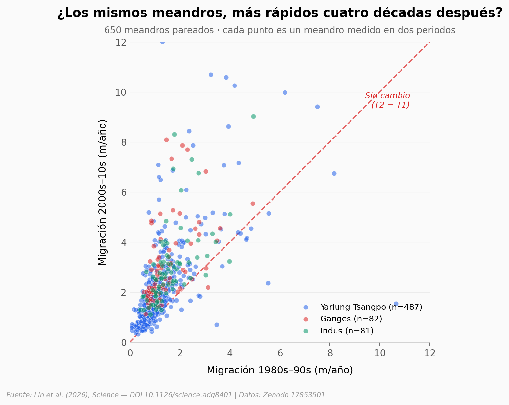

# Los ríos del Himalaya están serpenteando casi al doble de velocidad

Un equipo midió cómo migra lateralmente la mayoría de meandros de tres grandes cuencas del Himalaya — Yarlung Tsangpo, Ganges, Indus — en dos ventanas de cuatro décadas: 1980–2000 y 2000–2020. La pregunta no era si los ríos se mueven, sino si se mueven *más rápido* ahora.

**El hallazgo:** **La mediana de migración pasó de 1,02 a 1,81 m/año entre los dos periodos (ratio = 1,77×). El 93% de los 650 meandros pareados se movió más rápido en la segunda ventana.** El Ganges literalmente se duplicó (2,16×); el Yarlung Tsangpo, que aporta el 75% de la muestra, subió más modesto (1,62×).

## Gráfica clave



## Reproducir

[](https://colab.research.google.com/github/Ciencia-a-Mordiscos/lab/blob/main/papers/2026-05-14-rios-himalaya-meandros-clima/notebook.ipynb)

O localmente:

```bash
pip install pandas matplotlib numpy scipy
jupyter execute notebook.ipynb
```

## Datos

- `datos/meandros_pareados.csv` — 650 meandros × 14 columnas. Migración (m/año), curvatura, sinuosidad y tipo de canal medidos en T1 (1980s–90s) y T2 (2000s–10s). Trim de `Source_data_Fig.5.csv` original.
- `datos/clima_y_migracion_por_decada.csv` — 2.600 observaciones (650 meandros × 4 décadas) con variables climáticas (T, P, índice glaciar, NDVI, descargas) y migración. Trim de `Fig6_SEM.csv` original. ⚠️ Submuestra disjunta de `meandros_pareados.csv` (no comparten IDs).

## Links

- **Video:** [Ver en YouTube](https://youtube.com/shorts/NtBdIb3JngA)
- **Paper:** *Accelerated Himalayan river meandering and dynamics due to climate change* — Lin et al., **Science** (2026). [DOI: 10.1126/science.adg8401](https://doi.org/10.1126/science.adg8401)
- **Datos originales:** [Zenodo 10.5281/zenodo.17853501](https://doi.org/10.5281/zenodo.17853501)
