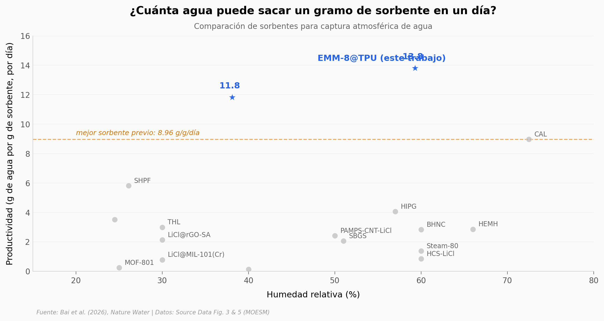

# Cómo una membrana flexible saca agua del aire 5 veces más rápido

425 millones de personas no tienen acceso a agua limpia. El aire que respiras —incluso en regiones áridas— está lleno de humedad. El problema nunca fue dónde está el agua: es qué tan rápido se puede atrapar y soltar de un material que pueda fabricarse a escala. Bai et al. construyeron una membrana de nanoláminas de zeolita (EMM-8) dentro de una matriz flexible de poliuretano que llega al 50% de su capacidad en **4.6 minutos** —entre 2.4 y 10.5 veces más rápido que cualquier sorbente publicado— y desorbe a 80°C en menos de 20 minutos.

**El hallazgo:** una hoja de EMM-8@TPU completa **72 ciclos en 24 horas** y acumula **11.78 g de agua por gramo de sorbente** (≈ 13.29 L/m²) a humedades de tan solo 38%.

## Gráfica clave



## Reproducir

[](https://colab.research.google.com/github/Ciencia-a-Mordiscos/lab/blob/main/papers/2026-05-14-zeolitas-agua-aire/notebook.ipynb)

O localmente:
```bash
pip install pandas matplotlib numpy scipy
jupyter execute notebook.ipynb
```

## Datos

Los CSVs en `datos/` se extrajeron de los Source Data files (MOESM6 — Fig. 3, MOESM8 — Fig. 5) publicados como Supplementary Information de Nature Water:

- `sorcion_kinetica.csv` — cinética de sorción de EMM-8@TPU a 30% RH y 25°C (3 réplicas, 0–30 min)
- `desorcion_kinetica.csv` — cinética de desorción a 65 °C, 70 °C y 80 °C (3 réplicas, 0–20 min)
- `cinetica_sorcion_comparada.csv` — razón de conversión vs tiempo para EMM-8@TPU y 6 sorbentes de referencia
- `productividad_sorbentes.csv` — productividad (g/g/d) a distintas humedades, EMM-8@TPU + 9 sorbentes de literatura
- `ciclado_productividad.csv` — 72 ciclos consecutivos en 24 h: agua colectada por ciclo y acumulado

## Links

- **Video:** [Pendiente]
- **Paper:** [Nature Water — DOI: 10.1038/s44221-026-00649-2](https://doi.org/10.1038/s44221-026-00649-2)
- **Datos originales:** [Supplementary Information (MOESM6, MOESM8)](https://static-content.springer.com/esm/art%3A10.1038%2Fs44221-026-00649-2/MediaObjects/)
